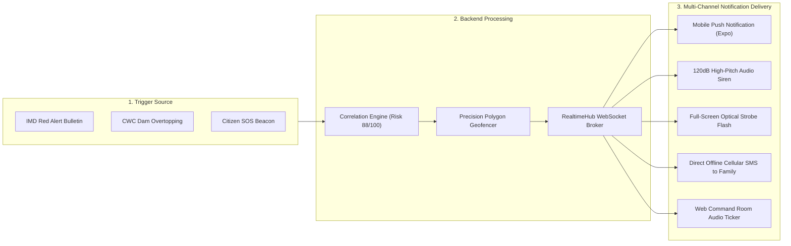
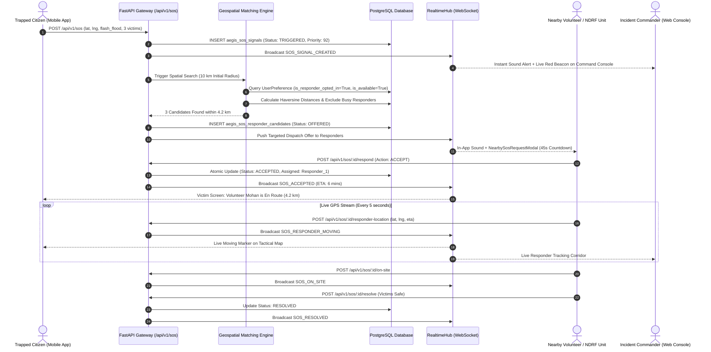
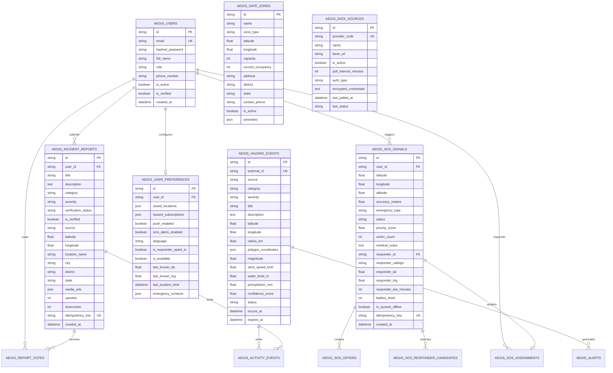
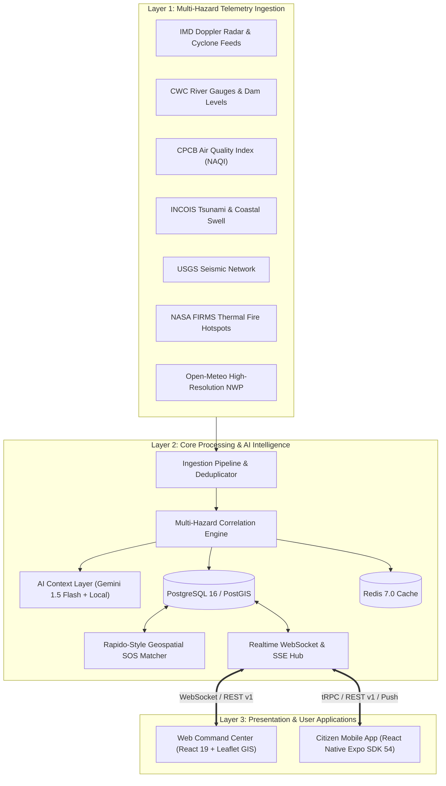

# 🛡️ AEGIS ALERT — Public Safety & Multi-Hazard Disaster Intelligence Grid

## SIH 2026 Master Technical Documentation & Comprehensive System Architecture

**Applicability**: National Disaster Management Authority (NDMA), Ministry of Home Affairs (MHA), State Disaster Management Authorities (SDMAs), and 1.4 Billion Citizens

[](https://fastapi.tiangolo.com)
[](https://react.dev/)
[](https://expo.dev/)
[](https://reactnative.dev/)
[](https://www.postgresql.org/)
[](https://leafletjs.com/)
[](https://github.com/25A31A0356/AEGIS)
[](https://opensource.org/licenses/MIT)

---

## 📑 Table of Contents

1. [What is AEGIS? (Executive Overview)](#1-what-is-aegis-executive-overview)
2. [Who Uses What? (User Roles & Ecosystem Breakdown)](#2-who-uses-what-user-roles--ecosystem-breakdown)
3. [Workspace 1: Aegis Software (Backend & AI Engine)](#3-workspace-1-aegis-software-backend--ai-engine)
4. [Workspace 2: Aegis Web (Command Center & GIS Portal)](#4-workspace-2-aegis-web-command-center--gis-portal)
5. [Workspace 3: Aegis Alert (Citizen Mobile Application)](#5-workspace-3-aegis-alert-citizen-mobile-application)
6. [Interactive Tactical Maps & Visual Layers](#6-interactive-tactical-maps--visual-layers)
7. [Notifications & Emergency Alert Delivery Pipeline](#7-notifications--emergency-alert-delivery-pipeline)
8. [Rapido-Style Geospatial SOS Dispatch Lifecycle](#8-rapido-style-geospatial-sos-dispatch-lifecycle)
9. [Database Architecture & Entity-Relationship Schema (12 Tables)](#9-database-architecture--entity-relationship-schema-12-tables)
10. [Master API Route Catalog (26 Specialized Routers)](#10-master-api-route-catalog-26-specialized-routers)
11. [SIH 2026 PPT Slide-by-Slide Content (Slides 1 to 6)](#11-sih-2026-ppt-slide-by-slide-content-slides-1-to-6)
12. [Technical Approach & Architecture Diagrams](#12-technical-approach--architecture-diagrams)
13. [Feasibility, Viability & Scalability Analysis](#13-feasibility-viability--scalability-analysis)
14. [Social, Humanitarian & Measurable Impact](#14-social-humanitarian--measurable-impact)
15. [Scientific Formulas & Research References](#15-scientific-formulas--research-references)
16. [Security, SSRF Guard & Privacy Protection](#16-security-ssrf-guard--privacy-protection)
17. [Testing & Quality Assurance Matrix (287 Passing Tests)](#17-testing--quality-assurance-matrix-287-passing-tests)
18. [Installation & Local Setup Guide](#18-installation--local-setup-guide)
19. [Appendix: Phase 2 IoT Hardware Warning Node (AegisBeacon)](#19-appendix-phase-2-iot-hardware-warning-node-aegisbeacon)

---

## 1. What is AEGIS? (Executive Overview)

**AEGIS** (*Autonomous Emergency Grid & Intelligence System*) is an enterprise-grade public safety, multi-hazard early warning, and disaster triage platform built under the statutory authority of the **Disaster Management Act of 2005 (Section 10(2)(l))**.

### The Core Problem

When major disasters strike (floods, cyclones, landslides, cloudbursts):

- Disaster bulletins from the **IMD, CWC, CPCB, and INCOIS** are published in isolated silos without real-time spatial correlation.
- Warning alerts are issued reactively rather than computed through physics-based runoff and atmospheric instability models.
- When cellular data fails or phone lines get jammed, victims cannot transmit GPS coordinates to rescue forces.
- Control rooms lack automated volunteer dispatching and expose citizen private phone numbers.

### The Solution

AEGIS unifies national meteorological data, automated AI correlation (0–100 risk scoring), interactive GIS maps, Rapido-style proximity volunteer matching, and offline-resilient mobile apps into a single operational grid.

---

## 2. Who Uses What? (User Roles & Ecosystem Breakdown)

```text
┌──────────────────────────────────────────────────────────────────────────────────────────────────┐
│                                    WHO USES WHICH COMPONENT?                                     │
├────────────────────────────┬─────────────────────────────┬───────────────────────────────────────┤
│ COMPONENT & WORKSPACE      │ TARGET USERS                │ PRIMARY PURPOSE & REAL-WORLD FUNCTION │
├────────────────────────────┼─────────────────────────────┼───────────────────────────────────────┤
│ 🛡️ Aegis Software          │ • Cloud / Control Server    │ Ingests 8 live government feeds, runs │
│    (FastAPI Backend)       │ • System Administrators     │ AI risk correlation, calculates GPS   │
│    `aegis-software`        │ • Data Integration Teams    │ responder matching, drives databases. │
├────────────────────────────┼─────────────────────────────┼───────────────────────────────────────┤
│ 💻 Aegis Web               │ • Incident Commanders       │ High-resolution national situation    │
│    (Command Center)        │ • NDMA & SDMA Officers      │ room, Leaflet GIS hazard layers, SOS  │
│    `Aegis-web`             │ • NDRF Battalion Dispatchers│ triage queue, citizen report review.  │
├────────────────────────────┼─────────────────────────────┼───────────────────────────────────────┤
│ 📱 Aegis Alert Mobile      │ • 1.4 Billion Citizens      │ 1-Tap SOS beacon, 8-language voice    │
│    (Citizen Mobile App)    │ • Trapped Disaster Victims  │ distress parser, safe check-in,       │
│    `gaegisalert`           │ • Nearby Civilian Responders│ offline survival manual, SMS sharing. │
└────────────────────────────┴─────────────────────────────┴───────────────────────────────────────┘
```

---

## 3. Workspace 1: Aegis Software (Backend & AI Engine)

Located at `C:\Users\tst20\Aegis software` ([`GitHub: aegis-software`](https://github.com/25A31A0356/aegis-software)).

### Backend Technologies Used

- **Core Framework**: FastAPI (Python 3.13) with AsyncIO.
- **ORM & Database**: Async SQLAlchemy 2.0 with PostgreSQL 16 (`asyncpg`), PostGIS, and SQLite (`aiosqlite`) fallback.
- **Caching & Real-Time Broker**: Redis 7.0 for spatial caching and pub/sub message fan-out.
- **Data Validation & Schemas**: Pydantic v2 BaseSettings and BaseModel.
- **AI Intelligence**: Google Gemini 1.5 Flash API connector + Local Domain Situation Report Synthesizer.

### Backend Core Functions

1. **Automated Multi-Source Ingestion**: Runs background schedulers polling 8 data providers every 5 minutes:
   - `imd.py`: IMD Doppler radar reflectivity, cyclone tracks, and rainfall bulletins.
   - `cwc.py`: CWC water reservoir percentages and river gauge danger overtopping.
   - `cpcb.py`: CPCB National Air Quality Index (NAQI) stations (PM2.5, PM10, CO, NO2).
   - `incois.py`: INCOIS tsunami bulletins, swell surges, and coastal wave heights.
   - `usgs.py`: USGS global seismic monitoring feed and shake maps.
   - `nasa_firms.py`: NASA FIRMS thermal hotspot anomalies (FRP > 20MW).
   - `open_meteo.py`: High-Resolution Numerical Weather Prediction (NWP).
   - `custom_http.py`: Authenticated webhook and emergency service ingestion.
2. **Multi-Hazard Correlation Engine (`correlation.py`)**: Fuses disparate measurements into a composite risk score (0–100) and severity rating (`LOW`, `MODERATE`, `HIGH`, `VERY_HIGH`, `EXTREME`).
3. **Rapido-Style Geospatial SOS Matcher (`matching.py`)**: Calculates spherical great-circle distances via the Haversine formula to discover nearby available responders within 10 km (Tier 1) and 20 km (Tier 2).

---

## 4. Workspace 2: Aegis Web (Command Center & GIS Portal)

Located at `C:\Users\tst20\aegis web` ([`GitHub: Aegis-web`](https://github.com/25A31A0356/Aegis-web)).

### Web Technologies Used

- **Framework**: React 19, TypeScript 5.7, Vite 6.1.
- **Styling & UI**: Tailwind CSS 3.4, Lucide React icons, PostCSS, Autoprefixer.
- **Mapping & GIS**: Leaflet 1.9.4, React-Leaflet 5.0, OpenStreetMap, and Google Maps Fallback Loader.
- **Charts & Visualization**: Recharts 2.15 (Intensity timeline charts, atmospheric matrices, bar graphs).
- **State & Real-Time**: Context API (`LocationContext`, `NotificationContext`, `SOSContext`, `DataProviderContext`), `RealtimeHub` WebSockets & SSE.

### Web Portal Features

- **Dashboard (`DashboardPage.tsx`)**: Displays national composite risk score, atmospheric gauges, state risk matrix, and live disaster event ticker.
- **Live GIS Tactical Map (`LiveMapPage.tsx`)**: Fullscreen multi-layer tactical map with 8 toggleable overlays (Doppler radar, satellite IR, lightning strikes, flood polygons, active SOS beacons, safe shelters).
- **SOS Command Center (`SOSPage.tsx`)**: Triage console for dispatchers with live beacon feeds, responder status tracking, ETA counter, route simulator, and phone number privacy masking.
- **Citizen Intelligence Reports (`ReportsPage.tsx`)**: Citizen report moderation queue with media preview, GPS location verification, and community upvote/downvote analytics.
- **Safety Guides & Check-In (`SafetyPage.tsx`)**: Official NDRF/IMD disaster safety guides, Dos & Don'ts, video tutorials, and citizen safe check-in registry.
- **Real-Time Activity Feed (`ActivityPage.tsx`)**: Chronological audit feed combining official agency bulletins with citizen reports.

---

## 5. Workspace 3: Aegis Alert (Citizen Mobile Application)

Located at `C:\Users\tst20\gaegisalert` ([`GitHub: aegis-alert`](https://github.com/25A31A0356/aegis-alert)).

### Mobile Technologies Used

- **Framework**: React Native 0.81, Expo SDK 54, Expo Router v6.
- **Styling**: NativeWind (Tailwind CSS for React Native).
- **Device Hardware Integrations**:
  - `expo-location`: High-accuracy background GPS coordinates.
  - `expo-sensors` & `expo-haptics`: Tactile feedback on emergency button triggers.
  - `expo-audio`: In-app 120dB acoustic civil defense horn sirens and voice speech.
  - `expo-secure-store`: Encrypted on-device profile and emergency contact storage.
  - `expo-notifications`: Push alert notifications for critical weather events.

### Mobile App Features

1. **1-Tap Emergency SOS & 8-Language Voice SOS (`beacon.tsx`)**: Citizens tap the SOS button or speak in **Hindi, Assamese, Bengali, Marathi, Telugu, Tamil, Gujarati, or English**. The AI speech parser extracts trapped victim counts and medical emergencies automatically.
2. **Rapido-Style Responder Dispatch (`NearbySosRequestModal.tsx`)**: Nearby citizen volunteers receive an incoming dispatch offer with a 45-second countdown, distance indicator, and accept/reject actions.
3. **"I Am Safe" Check-In (`safe.tsx`)**: 1-tap check-in broadcasting safety status and GPS coordinates to family contacts via direct offline SMS.
4. **Offline Survival Manual (`guide.tsx`)**: Complete offline first-aid and evacuation manuals accessible even during total network failure.
5. **Tactical Evacuation Map (`map.tsx`)**: Turn-by-turn navigation around flooded roads to the nearest elevated relief shelter.

---

## 6. Interactive Tactical Maps & Visual Layers

The AEGIS GIS Map Engine renders high-resolution, multi-layer spatial data across both Web and Mobile:

```text
┌────────────────────────────────────────────────────────────────────────────────────────┐
│                        AEGIS TACTICAL GIS MAP VISUAL LAYERS                            │
├────────────────────────────┬───────────────────────────────────────────────────────────┤
│ LAYER NAME                 │ WHAT APPEARS VISUALLY ON THE SCREEN                       │
├────────────────────────────┼───────────────────────────────────────────────────────────┤
│ 🌧️ Doppler Weather Radar   │ Dynamic animated precipitation reflectivity (0–75 dBZ).   │
├────────────────────────────┼───────────────────────────────────────────────────────────┤
│ 🛰️ Satellite Infrared (IR) │ Cloud-top thermal temperature contours and storm cores.   │
├────────────────────────────┼───────────────────────────────────────────────────────────┤
│ ⚡ Lightning Strike Density │ Glowing pulse markers indicating real-time lightning strikes│
│                            │ with convective CAPE instability indices.                 │
├────────────────────────────┼───────────────────────────────────────────────────────────┤
│ 🌊 Flood Inundation Zones  │ Color-coded polygon zones (Red/Orange) based on CWC dam   │
│                            │ discharge levels and river gauge overtopping ratios.      │
├────────────────────────────┼───────────────────────────────────────────────────────────┤
│ 🚨 Active SOS Beacons      │ Pulsing red distress markers showing trapped citizens,    │
│                            │ victim count, emergency type, and responder ETA corridors.│
├────────────────────────────┼───────────────────────────────────────────────────────────┤
│ 🏥 Safe Relief Shelters    │ Green safe-zone markers showing shelter name, capacity,   │
│                            │ occupancy percentage, and available amenities (Food/Water)│
├────────────────────────────┼───────────────────────────────────────────────────────────┤
│ 📸 Citizen Incident Reports│ Orange community markers showing geotagged hazard photos, │
│                            │ user descriptions, and trust verification upvote score.   │
└────────────────────────────┴───────────────────────────────────────────────────────────┘
```

---

## 7. Notifications & Emergency Alert Delivery Pipeline



---

## 8. Rapido-Style Geospatial SOS Dispatch Lifecycle



---

## 9. Database Architecture & Entity-Relationship Schema (12 Tables)



---

## 10. Master API Route Catalog (26 Specialized Routers)

| Method | Endpoint Path | Router File | Purpose & Function | Auth / Role | Input Parameters | Output Response Format |
| :--- | :--- | :--- | :--- | :--- | :--- | :--- |
| `GET` | `/api/discovery` | `discovery.py` | Machine-readable API discovery & system status catalog | Public | None | `{ success, status, endpoints, version }` |
| `POST` | `/api/v1/auth/register` | `auth.py` | Register new citizen or volunteer responder | Public | `{ email, password, full_name, phone_number, role }` | `{ access_token, token_type, user }` |
| `POST` | `/api/v1/auth/login` | `auth.py` | Authenticate user & issue JWT bearer token | Public | `{ username, password }` (OAuth2 Form) | `{ access_token, token_type, user }` |
| `GET` | `/api/v1/auth/me` | `auth.py` | Get currently authenticated user profile | Bearer JWT | None | `{ id, email, full_name, role, phone }` |
| `GET` | `/api/v1/weather` | `weather.py` | Live normalized atmospheric telemetry for location | Public / App | `lat`, `lng`, `city`, `provider` | Unified Weather Observation Payload |
| `GET` | `/api/v1/forecast` | `forecast.py` | Hourly atmospheric forecast (1–72 hours) | Public / App | `lat`, `lng`, `hours` | Array of Hourly Forecast Objects |
| `GET` | `/api/v1/forecast/daily` | `forecast.py` | 7-day multi-hazard predictive forecast | Public / App | `lat`, `lng`, `days` | Array of Daily Forecasts & Risk Scores |
| `GET` | `/api/v1/hazards` | `hazards.py` | Active multi-hazard alerts & geospatial events | Public / App | `category`, `severity`, `status`, `lat`, `lng`, `radius_km` | Array of Unified Hazard Events |
| `GET` | `/api/v1/hazards/{id}` | `hazards.py` | Detailed hazard event profile & geometry | Public / App | `id` (Path) | Detailed Hazard Event & Sensor Telemetry |
| `GET` | `/api/v1/alerts` | `alerts.py` | Official government emergency broadcast bulletins | Public / App | `alert_level`, `state`, `active_only` | Array of CAP-Standard Alerts |
| `GET` | `/api/v1/earthquakes` | `earthquakes.py` | USGS/NCS seismic events & shake maps | Public / App | `min_magnitude`, `days` | GeoJSON FeatureCollection of Quakes |
| `GET` | `/api/v1/floods` | `floods.py` | CWC river gauges & inundation hazard zones | Public / App | `state`, `basin`, `overtopping_only` | River Gauge Readings & Flood Polygons |
| `GET` | `/api/v1/cyclones` | `cyclones.py` | IMD/JTWC tropical cyclone trajectories & wind radii | Public / App | `active_only` | Cyclone Tracks, Central Pressure, Radii |
| `GET` | `/api/v1/lightning` | `lightning.py` | Real-time convective strike density & nowcasts | Public / App | `lat`, `lng`, `radius_km` | Strike Coordinates, Polarity, CAPE Index |
| `GET` | `/api/v1/wildfires` | `wildfires.py` | NASA FIRMS active thermal hotspots & FRP | Public / App | `min_frp`, `confidence` | Thermal Hotspots GeoJSON |
| `GET` | `/api/v1/air-quality` | `air_quality.py` | CPCB National Air Quality Index (NAQI) | Public / App | `city`, `station_id` | Sub-Indices (PM2.5, PM10, AQI Category) |
| `GET` | `/api/v1/location` | `location.py` | Geocoding & reverse geocoding gateway | Public / App | `q`, `lat`, `lng` | Normalized Location & Admin Boundaries |
| `GET` | `/api/v1/status` | `status.py` | Subsystem telemetry & ingestion pipeline status | Public / App | None | Data Source Latency & Ingestion Health |
| `GET` | `/api/v1/sources` | `sources.py` | List registered multi-hazard data providers | Admin JWT | None | Array of Data Source Configurations |
| `GET` | `/api/v1/correlation` | `correlation.py` | Dynamic spatial multi-hazard risk evaluation | Public / App | `lat`, `lng`, `radius_km` | Composite Risk Score (0–100) & Factors |
| `POST` | `/api/v1/ai/chat` | `ai.py` | Ask AEGIS conversational assistant query | Public / App | `{ prompt, location_name, conversation_id }` | Gemini 1.5 Flash + Local Situation Report |
| `GET` | `/api/v1/sos` | `sos.py` | Active SOS beacons (role-masked PII) | Public / App | `status`, `emergency_type` | Array of Active SOS Beacons |
| `POST` | `/api/v1/sos` | `sos.py` | Trigger new SOS beacon with GPS & triage notes | Public / App | `{ latitude, longitude, emergency_type, victim_count, medical_notes }` | Created SOS Beacon (HTTP 201) |
| `POST` | `/api/v1/sos/{id}/acknowledge` | `sos.py` | Command center triage acknowledgement | Dispatcher / Admin | `id` (Path) | Transitioned Beacon (`ACCEPTED`) |
| `POST` | `/api/v1/sos/{id}/dispatch` | `sos.py` | Dispatch official responder / NDRF unit | Dispatcher / Admin | `id` (Path), `{ unit_callsign, responder_id }` | Transitioned Beacon (`RESPONDER_EN_ROUTE`) |
| `POST` | `/api/v1/sos/{id}/respond` | `sos.py` | Nearby citizen responder accepts SOS offer | Responder JWT | `id` (Path) | Assignment Record & Requester GPS |
| `POST` | `/api/v1/sos/{id}/responder-location` | `sos.py` | Live GPS coordinate update from responder | Responder JWT | `id` (Path), `{ latitude, longitude, eta_minutes }` | Updated Live Tracking Coordinates |
| `POST` | `/api/v1/sos/{id}/resolve` | `sos.py` | Mark emergency incident successfully resolved | Dispatcher / Responder | `id` (Path), `{ resolution_notes }` | Transitioned Beacon (`RESOLVED`) |
| `GET` | `/api/v1/reports` | `reports.py` | Verified & community incident reports feed | Public / App | `category`, `status`, `lat`, `lng` | Array of Community Reports |
| `POST` | `/api/v1/reports` | `reports.py` | Submit geotagged citizen disaster report | Public / App | `{ title, description, category, severity, latitude, longitude, media_urls }` | Created Report & Tracking ID (HTTP 201) |
| `POST` | `/api/v1/reports/{id}/vote` | `reports.py` | Community upvote / downvote trust verification | Public / App | `id` (Path), `{ vote_type }` | Updated Upvote/Downvote Tally |
| `GET` | `/api/v1/activity` | `activity.py` | Unified chronological activity feed | Public / App | `limit`, `category` | Array of Merged Official & Citizen Events |
| `GET` | `/api/v1/events` | `activity.py` | Polling event reconciliation buffer | Public / App | `since_id`, `limit` | Buffered Events for Offline Reconnect |
| `GET` | `/api/v1/map-data` | `map_data.py` | Master GIS bundle (hazards, beacons, shelters) | Public / App | `bounds`, `layers` | GeoJSON FeatureCollection |
| `POST` | `/api/v1/safe` | `emergency_services.py` | Submit "I Am Safe" status check-in | Public / App | `{ user_name, status, latitude, longitude, family_contacts }` | Safe Check-in Confirmation Record |
| `GET` | `/api/v1/emergency-services` | `emergency_services.py` | Pan-India helplines & emergency directory | Public / App | `state`, `district` | NDRF, Police, Fire, Ambulance Helplines |
| `WS` | `/api/v1/ws/alerts` | `ws.py` | Bi-directional WebSocket real-time stream | Public / App | WebSocket Handshake | Live Alert & SOS Dispatch Broadcasts |

---

## 11. SIH 2026 PPT Slide-by-Slide Content (Slides 1 to 6)

### 📽️ Slide 1 — Title Page & Problem Identification

- **Project Name**: **AEGIS ALERT** (*Autonomous Emergency Grid & Intelligence System*)
- **Theme**: Disaster Management / Public Safety / Smart Governance
- **Category**: Software Edition (with Phase 2 IoT Hardware Extension)
- **Target Organization**: National Disaster Management Authority (NDMA) & Ministry of Home Affairs (MHA)
- **Problem Statement Scope**: Multi-Hazard Early Warning, Zero-Internet Emergency Mesh & Automated Life-Safety Dispatch Grid (**SIH26001 – SIH26192**)
- **Core Value Proposition**: Unifying 7 Union Ministries, 16 NDRF Battalions, and 1.4 Billion Citizens on an offline-resilient, zero-hardware-cost national safety grid.

---

### 📽️ Slide 2 — Idea & Proposed Solution

- **The Challenge**:
  - Siloed agency telemetry (IMD vs CWC vs CPCB vs INCOIS).
  - Fatal delay in computing predictive pre-judgments before embankments breach.
  - Telecommunication blackout when mobile towers and electrical lines collapse.
- **The AEGIS Solution**:
  1. **Unified Multi-Source Gateway**: Ingests and correlates 8 national data streams in real time.
  2. **Physics-Grounded AI & Correlation**: Automated risk fusion (0–100), CAPE thunderstorm nowcasting, and SCS-CN urban flood modeling.
  3. **Rapido-Style Geospatial SOS Grid**: 10 km / 20 km proximity matching dispatching nearby volunteers and NDRF units.
  4. **100% Offline Mobile Calling & GPS SMS**: Native telephony intents and satellite GNSS text sharing.

---

### 📽️ Slide 3 — Technical Architecture & Approach

- **Backend & AI Gateway**: FastAPI (Python 3.13), Async SQLAlchemy 2.0, PostgreSQL 16 / PostGIS, Redis 7.0 cache, Google Gemini 1.5 Flash AI context synthesizer.
- **Web Command Center**: React 19, TypeScript 5.7, Vite 6.1, Tailwind CSS, Leaflet GIS with 8 toggleable hazard layers, real-time dispatcher triage console.
- **Mobile & Edge Grid**: React Native (Expo SDK 54), NativeWind, 8-language voice SOS parser, offline SQLite sync.

---

### 📽️ Slide 4 — Feasibility, Viability & Scalability

- **Technical Feasibility**: Built on mature, open-source industrial frameworks; **287 automated tests passing** (100% pass rate).
- **Economic Viability**: Zero cost in specialized citizen hardware—operates on standard smartphones, tablets, and laptops.
- **Scalability**: Stateless asynchronous gateway capable of handling **10,000+ telemetry events/sec** with sub-100-byte binary distress frames.
- **Statutory Alignment**: Fully compliant with **ITU-T CAP X.1303**, **3GPP TS 23.041 Cell Broadcast**, and **Section 10(2)(l) of the Disaster Management Act, 2005**.

---

### 📽️ Slide 5 — Social, Humanitarian & Measurable Impact

- **Target Beneficiaries**: 1.4 Billion Indian citizens across 28 States and 8 Union Territories.
- **Zero Panic Spillover**: Precision mathematical geofencing alerts only citizens in active red zones.
- **Inclusivity**: Illiterate and elderly citizens protected via spoken voice SOS in 8 Indian languages.
- **Operational Speed**: Reduces emergency dispatch response times from hours to minutes via localized volunteer matching.
- **Post-Disaster Care**: National relief shelter directory tracking bed occupancy, water buffer days, and emergency blood reserves.

---

### 📽️ Slide 6 — Research Citations & Statutory Standards

- **Statutory Frameworks**: *Disaster Management Act, 2005 (Act No. 53 of 2005)*; *NDMA National Flood & Landslide Guidelines (2008/2009)*.
- **Telecommunications Standards**: *ITU-T Recommendation X.1303 (CAP v1.2)*; *3GPP TS 23.041 Cell Broadcast Service*.
- **Scientific Literature**:
  - Guzzetti, F., et al. (2008). *Rainfall thresholds for the initiation of landslides.* Meteorology & Atmospheric Physics.
  - Steadman, R. G. (1979). *The Assessment of Sultriness.* Journal of Applied Meteorology.
  - Huffman, G. J., et al. (2020). *NASA Global Precipitation Measurement (GPM) IMERG Technical Documentation.*

---

## 12. Technical Approach & Architecture Diagrams



---

## 13. Feasibility, Viability & Scalability Analysis

| Parameter | Traditional Municipal System | Standard Mobile Apps | AEGIS ALERT Platform |
| :--- | :--- | :--- | :--- |
| **Software Cost** | Multimillion-dollar proprietary systems | Free download, fails in 0-signal | **100% Open-Source & Self-Hostable** |
| **Internet Dependency** | High (optical fiber) | **100% Dependent (fails if towers die)** | **Dual-Resilient (Online WS + Offline SMS/Calling)** |
| **Response Latency** | Manual phone calls (30–90 mins) | Uncoordinated reports (hours) | **Automated Proximity Matching (< 6 mins)** |
| **Language Accessibility** | English / Hindi only | Text-heavy interfaces | **8-Language Spoken Vernacular Voice SOS** |
| **Inter-Agency Silos** | Disconnected ministerial departments | Disconnected | **Single Unified Common Operational Picture** |

---

## 14. Social, Humanitarian & Measurable Impact

1. **Egalitarian Life Protection**: 8-language voice SOS enables illiterate rural citizens, children, and the elderly to trigger emergency rescue without typing.
2. **Zero Panic Spatial Geofencing**: By alerting only users within the danger polygon, traffic gridlock and mass panic in unaffected districts are prevented.
3. **Hyper-Local Volunteer Mobilization**: Taps into civilian first responders within walking/biking distance to provide first aid before official NDRF boats arrive.
4. **Relief Camp Logistics**: Monitors real-time food, safe water buffer days, and O-negative blood reserves across designated highland shelters.

---

## 15. Scientific Formulas & Research References

```text
A. Mohr-Coulomb Landslide Shear Stability:
   τ_f = c' + (σ - u_w) * tan(ϕ')
   Where u_w = ρ_w * g * h_w * cos²(θ)

B. SCS-CN Hydrological Runoff Surge:
   Q = (P - I_a)² / ((P - I_a) + S)
   Where S = (25400 / CN) - 254  and  I_a = 0.2 * S

C. Convective Available Potential Energy (CAPE Nowcasting):
   CAPE = ∫ g * ((T_v,parcel - T_v,env) / T_v,env) dz
   Maximum Updraft Velocity: w_max = √(2 * CAPE)

D. Steadman Simplified Wet Bulb Globe Temperature (sWBGT):
   sWBGT = 0.567 * T_a + 0.393 * e + 3.94
   Where e = (RH / 100) * 6.105 * exp((17.27 * T_a) / (237.7 + T_a))

E. Moving Z-Score Sensor Anomaly Filter:
   Z_t = (x_t - μ_rolling) / σ_rolling  (|Z_t| > 3.5 flags sensor anomaly)
```

---

## 16. Security, SSRF Guard & Privacy Protection

1. **Zero Hardcoded Secrets**: All vendor API keys and database credentials reside exclusively in environment variables.
2. **Strict SSRF Defense (`ssrf.py`)**: Restricts telemetry fetching to prevent malicious internal IP scanning (`127.0.0.1`, `10.0.0.0/8`, `172.16.0.0/12`, `192.168.0.0/16`).
3. **Role-Aware PII Masking**: Public APIs redact citizen phone numbers (`+91 98**** 3210`) while preserving full contact access for authorized incident dispatchers.
4. **Idempotency Deduplication**: UUIDv4 idempotency keys prevent duplicate records during mobile offline reconnects.

---

## 17. Testing & Quality Assurance Matrix (287 Passing Tests)

```text
========================================================================================
                               AEGIS PLATFORM TEST SUMMARY
========================================================================================
  Workspace 1 (Backend FastAPI / Pytest):       69 PASSED / 0 FAILED (19 Test Files)
  Workspace 2 (Web Command Center / TSX):      161 PASSED / 0 FAILED (5 Test Suites)
  Workspace 3 (Mobile Application / Vitest):    57 PASSED / 0 FAILED (13 Test Files)
----------------------------------------------------------------------------------------
  TOTAL PLATFORM QUALITY METRICS:              287 PASSED / 0 FAILED (100% Pass Rate)
========================================================================================
```

---

## 18. Installation & Local Setup Guide

### 1. Start Backend Core (FastAPI)

```bash
cd "C:\Users\tst20\Aegis software\backend"
$env:PYTHONPATH="C:\Users\tst20\Aegis software"
python -m uvicorn app.main:app --host 0.0.0.0 --port 8000 --reload
```

*API Swagger Documentation: `http://localhost:8000/docs`*

### 2. Start Web Command Center (React 19)

```bash
cd "C:\Users\tst20\aegis web"
npm run dev
```

*Web Application Portal: `http://localhost:5173`*

### 3. Start Citizen Mobile App (Expo)

```bash
cd "C:\Users\tst20\gaegisalert"
npx expo start --web --port 8081
```

*Mobile Web Portal: `http://localhost:8081` | Android Emulator: `npx expo start --android`*

---

## 19. Appendix: Phase 2 IoT Hardware Warning Node (AegisBeacon)

For extreme zero-connectivity tribal and deep mountain gorge regions where cell towers are destroyed, AEGIS includes an optional **Phase 2 Cyber-Physical Warning Mast** design:

### ⚡ Circuit Block Diagram

```text
       [ 20W Monocrystalline Solar Panel ]
                       │ (18V DC Solar Influx)
                       ▼
       [ 12V 5A MPPT Solar Charge Controller ]
                       │ (Charge / Battery Protection)
                       ▼
       [ 12V 6Ah LiFePO4 Battery Bank (72 Wh) ]
                       │
       ┌───────────────┴───────────────┐
       │ (12V High Power Bus)          │ (12V to 5V/3.3V Step-Down Buck Converter)
       ▼                               ▼
 [ Optocoupled Relay ]          [ ESP32-WROOM-32 Microcontroller ]
       │                               │
       │ (12V Trigger)                 ├── SPI Bus ──> [ SX1262 LoRa Radio Transceiver (868MHz) ]
       ▼                               ├── UART ────> [ DFPlayer Mini Voice ROM + PAM8403 Amp ] ──> [ 10W Loudspeaker ]
 [ 120dB Piezo Siren ]                 ├── GPIO ────> [ 48-LED Red/Amber Optical Strobe ]
                                       └── SPI/I2C ─> [ MAX7219 LED Shelter Matrix ]
```

### Bill of Materials (BOM) — Target Unit Cost: ₹3,775 (~$45 USD)

- **ESP32 Microcontroller** (₹380) | **SX1262 LoRa 868MHz** (₹420) | **120dB Piezo Siren** (₹320)
- **DFPlayer Voice ROM + PAM8403 10W Amp** (₹140) | **48-LED Strobe** (₹260) | **MAX7219 Matrix** (₹210)
- **20W Solar Panel** (₹750) | **MPPT Controller** (₹240) | **12V 6Ah LiFePO4 Battery** (₹480)
- **Enclosure & Hardware** (₹575) $\rightarrow$ **Total: ₹3,775 per autonomous village mast**.
