# 🛡️ AEGIS ALERT — Master Project Intelligence & Source of Truth
### Multi-Workspace Analysis • Verified System Architecture • SIH 2026 Dossier

---

## 1. Executive Summary & Problem Scope

**AEGIS** (*Autonomous Emergency Grid & Intelligence System*) is a unified cyber-physical disaster early-warning, situational awareness, and life-safety operations grid developed for the **Smart India Hackathon (SIH 2026)** under the statutory mandate of the **National Disaster Management Authority (NDMA)** and the **Ministry of Home Affairs (MHA)**.

### The Systemic Crisis in Indian Disaster Management
1. **Fragmented Institutional Telemetry**: India Meteorological Department (IMD), Central Water Commission (CWC), Central Pollution Control Board (CPCB), and Indian National Centre for Ocean Information Services (INCOIS) publish independent, non-correlated bulletins.
2. **Lack of Automated Pre-Judgments**: Disaster warnings are traditionally issued after water levels overtop rather than forecast through physics-based runoff and thermodynamic instability models.
3. **Telecommunication Collapse**: Cyclones and flash floods sever cell towers, power lines, and fiber cables, rendering conventional internet applications non-functional.
4. **Uncoordinated Emergency Response**: Responders lack proximity-based triage and rely on overloaded phone helplines with exposed citizen PII.

### The AEGIS Solution
AEGIS integrates **three specialized software workspaces** and **autonomous sub-GHz hardware beacon nodes** into a unified, resilient disaster grid.

---

## 2. Verified 3-Workspace Structure & Repositories

```mermaid
graph TD
    subgraph Repo_Master ["🌐 Master Project Umbrella"]
        AEGIS_MAIN["https://github.com/25A31A0356/AEGIS"]
    end

    subgraph WS1 ["🛡️ Workspace 1: aegis-software (Backend & AI)"]
        WS1_PATH["C:\\Users\\tst20\\Aegis software"]
        WS1_REPO["https://github.com/25A31A0356/aegis-software.git"]
        WS1_TECH["FastAPI • Python 3.13 • SQLAlchemy 2.0 • PostgreSQL • Redis • PostGIS"]
    end

    subgraph WS2 ["💻 Workspace 2: Aegis-web (Command Center)"]
        WS2_PATH["C:\\Users\\tst20\\aegis web"]
        WS2_REPO["https://github.com/25A31A0356/Aegis-web.git"]
        WS2_TECH["React 19 • TypeScript 5.7 • Vite 6.1 • Tailwind CSS • Leaflet GIS"]
    end

    subgraph WS3 ["📱 Workspace 3: aegis-alert (Mobile App & Hardware)"]
        WS3_PATH["C:\\Users\\tst20\\gaegisalert"]
        WS3_REPO["https://github.com/25A31A0356/aegis-alert.git"]
        WS3_TECH["React Native • Expo SDK 54 • NativeWind • ESP32 LoRa Node (868 MHz)"]
    end

    AEGIS_MAIN --> WS1
    AEGIS_MAIN --> WS2
    AEGIS_MAIN --> WS3
```



---

## 3. SIH 2026 Problem Statement Matrix

| Problem Statement ID | Official Title | Implemented Component | Status |
|---|---|---|:---:|
| **SIH26001** | AI-Based Early Warning & Landslide Risk Monitoring | Mohr-Coulomb shear analysis & slope stability engine (`hazard_engine.py`) | 🟢 Implemented |
| **SIH26068** | WeatherGPT Conversational Intelligence | **Ask AEGIS** multimodal conversational assistant (`ai_layer.py`, `ask.tsx`) | 🟢 Implemented |
| **SIH26069** | National Weather Big Data Analytics | Pan-India spatial telemetry database & time-series cache (`weather.py`) | 🟢 Implemented |
| **SIH26071** | Heavy Rainfall Warning & Inundation Prediction | SCS-CN runoff surge & river gauge overtopping analyzer (`cwc.py`) | 🟢 Implemented |
| **SIH26072** | Thunderstorm & Lightning Nowcasting | CAPE index & convective strike 1–6 hour predictive nowcasting (`lightning.py`)| 🟢 Implemented |
| **SIH26073** | Weather Station Anomaly Detection | Automated moving Z-score & frozen sensor variance filter (`validator.py`) | 🟢 Implemented |
| **SIH26077** | Hyperlocal Severe Weather Early Warning | Dynamic polygon geofencing & 6-hour localized timeline (`TimelineSlider.tsx`) | 🟢 Implemented |
| **SIH26078** | Spatio-Temporal Extreme Weather Tracking | Leaflet GIS Tactical Map with 8 toggleable hazard layers (`InteractiveLocationMap.tsx`) | 🟢 Implemented |
| **SIH26080** | Monsoon Rainfall Forecast Post-Processing | Precipitation curve smoothing & runoff acceleration modeling (`correlation.py`) | 🟢 Implemented |
| **SIH26082** | Air Pollution–Weather Coupled Forecasting | Coupled PM2.5/PM10 dispersion & thermal inversion modeling (`air_quality.py`) | 🟢 Implemented |
| **SIH26083** | Extreme Heatwave & Human Thermal Stress | Steadman Heat Index & Simplified Wet Bulb Globe Temperature (`units.py`) | 🟢 Implemented |
| **SIH26084** | Thunderstorm, Hail & Cloudburst Nowcasting | Cloudburst core detection (>100 mm/h) & pilgrim route alarms (`forecast.py`) | 🟢 Implemented |
| **SIH26085** | Urban Flood Nowcasting | Urban drainage bottleneck & stormwater flood prediction (`floods.py`) | 🟢 Implemented |
| **SIH26191** | Hazard Red Zones & Vulnerable Habitations | Statutory Red-Zone Habitations Register & evacuation corridors (`models.py`) | 🟢 Implemented |
| **SIH26192** | Flash Flood Prediction for Hilly Regions | High-velocity mountain gorge surge & debris flow prediction (`hazard_engine.py`) | 🟢 Implemented |

---

## 4. Scientific & Mathematical Modeling

```
A. Mohr-Coulomb Landslide Shear Stability:
   τ_f = c' + (σ - u_w) * tan(ϕ')
   Where u_w = ρ_w * g * h_w * cos²(θ)

B. SCS-CN Hydrological Runoff Surge:
   Q = (P - I_a)² / ((P - I_a) + S)
   Where S = (25400 / CN) - 254  and  I_a = 0.2 * S

C. Convective Available Potential Energy (CAPE Nowcasting):
   CAPE = ∫ g * ((T_v,parcel - T_v,env) / T_v,env) dz
   Maximum Updraft Velocity: w_max = √(2 * CAPE)

D. Steadman Simplified Wet Bulb Globe Temperature (sWBGT):
   sWBGT = 0.567 * T_a + 0.393 * e + 3.94
   Where e = (RH / 100) * 6.105 * exp((17.27 * T_a) / (237.7 + T_a))

E. Moving Z-Score Sensor Anomaly Filter:
   Z_t = (x_t - μ_rolling) / σ_rolling  (|Z_t| > 3.5 flags sensor anomaly)
```

---

## 5. Master API Architecture (FastAPI v1)

```
BASE URL: http://localhost:8000/api/v1 (or /api)

├── Discovery & Auth
│   ├── GET  /discovery                  # Machine-readable API discovery
│   ├── POST /v1/auth/register           # Citizen & volunteer registration
│   ├── POST /v1/auth/login              # JWT Bearer token authentication
│   └── GET  /v1/auth/me                 # Current authenticated user profile
│
├── Multi-Hazard Telemetry & Feeds
│   ├── GET  /v1/weather                 # Normalized weather observation
│   ├── GET  /v1/forecast                # 1–72 hour hourly forecast
│   ├── GET  /v1/forecast/daily          # 7-day multi-hazard predictive forecast
│   ├── GET  /v1/hazards                 # Active multi-hazard geospatial events
│   ├── GET  /v1/alerts                  # CAP-standard government emergency bulletins
│   ├── GET  /v1/earthquakes             # USGS seismic feed & shake maps
│   ├── GET  /v1/floods                  # CWC river gauge readings & flood polygons
│   ├── GET  /v1/cyclones                # IMD cyclone trajectories & wind radii
│   ├── GET  /v1/lightning               # Strike density & CAPE convective nowcasts
│   ├── GET  /v1/wildfires               # NASA FIRMS thermal hotspots (>20MW FRP)
│   ├── GET  /v1/air-quality             # CPCB National Air Quality Index (NAQI)
│   └── GET  /v1/correlation             # Multi-source spatial composite risk score
│
├── Rapido-Style SOS Dispatch Grid
│   ├── GET  /v1/sos                     # Active SOS beacons (role-masked PII)
│   ├── POST /v1/sos                     # Trigger new emergency SOS beacon (HTTP 201)
│   ├── POST /v1/sos/:id/acknowledge     # Dispatcher triage acknowledgement
│   ├── POST /v1/sos/:id/dispatch        # Dispatch official responder / NDRF unit
│   ├── POST /v1/sos/:id/respond         # Nearby volunteer responder accepts offer
│   ├── POST /v1/sos/:id/responder-location # Real-time responder GPS & ETA update
│   └── POST /v1/sos/:id/resolve         # Successfully resolve emergency incident
│
├── Citizen Intelligence & Realtime
│   ├── GET  /v1/reports                 # Verified & community incident reports
│   ├── POST /v1/reports                 # Submit geotagged citizen report (HTTP 201)
│   ├── POST /v1/reports/:id/vote        # Community trust verification upvote/downvote
│   ├── GET  /v1/activity                # Chronological activity stream
│   ├── GET  /v1/events                  # Polling reconciliation buffer for offline reconnect
│   ├── GET  /v1/map-data                # Master GIS bundle (hazards, beacons, shelters)
│   ├── POST /v1/safe                    # Citizen "I Am Safe" check-in
│   ├── GET  /v1/emergency-services      # Pan-India helplines directory
│   └── WS   /v1/ws/alerts               # Bi-directional WebSocket stream
```

---

## 6. Rapido-Style SOS Dispatch & Geospatial Matching Workflow

```mermaid
sequenceDiagram
    autonumber
    actor Victim as 🔴 Trapped Citizen
    participant API as 🛡️ FastAPI Gateway
    participant Matcher as 📍 Spatial Matcher (10km / 20km)
    participant DB as 🗄️ PostgreSQL / PostGIS
    participant WS as âš¡ Realtime WebSocket Hub
    actor Responder as 🟢 Nearby Volunteer / NDRF
    actor Commander as 👮 Incident Commander

    Victim->>API: POST /api/v1/sos (lat, lng, flash_flood, 3 victims)
    API->>DB: INSERT aegis_sos_signals (Status: TRIGGERED, Priority: 92)
    API->>WS: Broadcast SOS_SIGNAL_CREATED
    WS-->>Commander: Instant Alert + Red Beacon on Web Command Console

    API->>Matcher: Find Available Responders (10 km Initial Radius)
    Matcher->>DB: Query UserPreference (is_responder_opted_in=True, is_available=True)
    Matcher->>DB: Calculate Spherical Haversine Distances
    Matcher-->>API: 3 Candidates Found within 4.2 km
    API->>DB: INSERT aegis_sos_responder_candidates (Status: OFFERED)
    API->>WS: Push Targeted Dispatch to Responders

    WS-->>Responder: In-App Sound + NearbySosRequestModal (45s Countdown)
    Responder->>API: POST /api/v1/sos/:id/respond (Action: ACCEPT)
    API->>DB: Atomic State Transition (Status: ACCEPTED)
    API->>WS: Broadcast SOS_ACCEPTED (ETA: 6 mins)
    WS-->>Victim: Victim Screen: "Volunteer Mohan is En Route (4.2 km)"

    loop Live GPS Stream (Every 5s)
        Responder->>API: POST /api/v1/sos/:id/responder-location (lat, lng, eta)
        API->>WS: Broadcast SOS_RESPONDER_MOVING
        WS-->>Victim: Live Moving Marker on Tactical Map
        WS-->>Commander: Live Responder Tracking Corridor
    end

    Responder->>API: POST /api/v1/sos/:id/on-site
    API->>WS: Broadcast SOS_ON_SITE
    Responder->>API: POST /api/v1/sos/:id/resolve (Victims Safe)
    API->>DB: Update Status: RESOLVED
    API->>WS: Broadcast SOS_RESOLVED
```



---

## 7. Cyber-Physical Hardware Node (AegisBeacon BOM)

| Component | Specification | Qty | Unit Cost (INR) | Purpose |
|---|---|:---:|:---:|---|
| **ESP32 Microcontroller** | ESP32-WROOM-32 (Dual Core 240MHz, Ultra-Low Power) | 1 | ₹380 | State machine & CRC checking |
| **Sub-GHz LoRa Transceiver** | Semtech SX1262 868.1 MHz SPI (+22 dBm ERP) | 1 | ₹420 | Zero-internet radio mesh receiver |
| **Fiberglass Antenna** | 868MHz 5dBi Fiberglass Omni-Directional | 1 | ₹180 | Long-range 360° storm reception |
| **Tactical Piezo Siren** | 12V DC 120dB High-Decibel Evacuation Horn | 1 | ₹320 | 2–3 km village auditory warning |
| **Audio Voice DAC & Amp** | DFPlayer Mini (MicroSD Voice ROM) + PAM8403 10W | 1 | ₹140 | Vernacular spoken Hindi/English voice |
| **Optical Strobe Array** | 12V 48-LED Ultra-Bright Red/Amber Flasher | 1 | ₹260 | Visual warning for deaf/fog/night |
| **Alphanumeric LED Matrix** | MAX7219 4-in-1 Dot Matrix Display Module | 1 | ₹210 | High-contrast safe shelter text |
| **Solar Photovoltaic Panel** | 20W Monocrystalline Solar Panel | 1 | ₹750 | Infinite off-grid renewable energy |
| **Solar Charge Controller** | 12V 5A MPPT Solar Battery Controller | 1 | ₹240 | Power regulation & circuit protection |
| **Battery Storage Bank** | 12V 6Ah LiFePO4 Pack (72 Watt-hours) | 1 | ₹480 | 75 days standby / 24+ days blackout |
| **Actuator Relays & Enclosure**| 2-Channel Relay + IP66 Polycarbonate Enclosure | 1 | ₹395 | Weatherproof hardware packaging |
| **TOTAL UNIT COST** | **Complete Autonomous Warning Mast** | **1 Unit** | **₹3,775 (~$45)** | **10x cheaper than legacy sirens** |

---

## 8. Verification & Quality Assurance Summary

- **Workspace 1 (Backend)**: 69 / 69 `pytest` unit & integration tests passing (100%).
- **Workspace 2 (Web)**: 161 / 161 `tsx` assertions across 5 verification suites passing (100%).
- **Workspace 3 (Mobile)**: 57 / 57 `vitest` assertions across 13 test files passing (100%).
- **Total Platform**: **287 / 287 automated tests passing with 0 failures**.

