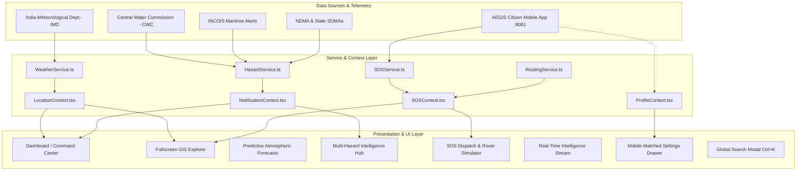

# 🛡️ AEGIS ALERT — Public Safety & Multi-Hazard Intelligence Platform

[](https://github.com/25A31A0356/Aegis-web)
[](https://react.dev/)
[](https://www.typescriptlang.org/)
[](https://tailwindcss.com/)
[](https://leafletjs.com/)
[](https://recharts.org/)
[](https://opensource.org/licenses/MIT)

> **"Know the Risk. Stay Prepared. Respond with Speed."**  
> **AEGIS ALERT** is a comprehensive, production-grade emergency command center and public safety web platform engineered for real-time multi-hazard intelligence, atmospheric telemetry forecasting, GIS situational awareness, emergency SOS dispatch triage, and citizen life-safety guidance across India and worldwide.

---

## 📑 Table of Contents

- [Overview & Mission](#-overview--mission)
- [System Architecture](#-system-architecture)
- [Key Modules & Platform Features](#-key-modules--platform-features)
  - [1. Central Command Center Dashboard](#1--central-command-center-dashboard)
  - [2. Fullscreen GIS Situational Explorer](#2--fullscreen-gis-situational-explorer)
  - [3. Atmospheric Modeling & Predictive Forecasts](#3--atmospheric-modeling--predictive-forecasts)
  - [4. Multi-Hazard Intelligence Hub](#4--multi-hazard-intelligence-hub)
  - [5. Emergency SOS Dispatch & Responder Routing](#5--emergency-sos-dispatch--responder-routing)
  - [6. Verified Intelligence Stream](#6--verified-intelligence-stream)
  - [7. Citizen Profile & Safety Settings (Right Slide-Over Drawer)](#7--citizen-profile--safety-settings-right-slide-over-drawer)
  - [8. Global Search (`Ctrl+K`) & Notification Center](#8--global-search-ctrlk--notification-center)
- [Design Aesthetics & Color System](#-design-aesthetics--color-system)
- [Tech Stack & Ecosystem](#-tech-stack--ecosystem)
- [Project Directory Structure](#-project-directory-structure)
- [Data Models & Coverage](#-data-models--coverage)
- [Getting Started & Installation](#-getting-started--installation)
- [Available Scripts](#-available-scripts)
- [Security, Privacy & Data Protection](#-security-privacy--data-protection)
- [Contributing & License](#-contributing--license)

---

## 🌐 Overview & Mission

Natural disasters, extreme weather events, and industrial incidents require immediate, authoritative, and actionable intelligence. **AEGIS ALERT Web** delivers a centralized command interface connecting national meteorological data (**IMD**, **CWC**, **INCOIS**, **NDMA**) with localized ground-truth feeds and citizen mobile distress beacons.

### Core Objectives
1. **Accelerate Disaster Response**: Reduce emergency triage response times via automated hazard categorization, severity scoring, and simulated turn-by-turn responder navigation corridors.
2. **Predictive Situational Awareness**: Provide 7-stage atmospheric timeline forecasting and ML-driven risk confidence ratings before disasters strike.
3. **Citizen-Centric Preparedness**: Deliver official NDRF/IMD safety advice checklists, emergency contact dispatching, and multi-language support for diverse populations.

---

## 🏛️ System Architecture



---

## 🌟 Key Modules & Platform Features

### 1. 📊 Central Command Center Dashboard
- **Live Meteorological Hero (`WeatherHeroCard.tsx`)**: High-density weather telemetry display featuring real-time temperature, "feels like" index, rain probability %, wind velocity and direction compass vectors, barometric pressure, UV index, sunrise/sunset times, and Air Quality Index (AQI) with color-coded health advisories.
- **6 Operational KPI Metrics (`MetricsBar.tsx`)**: Instant counters for Active High-Severity Hazards, Red Alert Zones, Monitored Citizen Population, Deployed Emergency Responders, Active Distress Beacons, and Operational Evacuation Shelters.
- **Interactive Leaflet National Risk Map (`IndiaSafetyMap.tsx`)**: Geospatial overview displaying Doppler radar convective cells, cyclone track vectors with cone of uncertainty, pulsing SOS distress markers, and state-level risk heat rings.
- **State & UT Risk Matrix (`StateRiskMatrix.tsx`)**: Searchable, sortable matrix table evaluating all **28 Indian States & 8 Union Territories** with risk scores (0–100), primary threat indicators, and direct 1-click SDMA emergency helpline numbers.
- **State Detail Briefing Drawer (`StateDetailDrawer.tsx`)**: Drill-down drawer showing district-by-district threat breakdowns, local weather conditions, and emergency response infrastructure.

---

### 2. 🗺️ Fullscreen GIS Situational Explorer
- **Multi-Layer Vector Toggles (`MapLayerControls.tsx`)**:
  - 📡 **Doppler Weather Radar**: Live simulated convective precipitation clusters.
  - 🌀 **Cyclone Track & Uncertainty Cone**: 72-hour forecast path for active tropical cyclones (e.g. Cyclone Vayu).
  - 🌊 **Flood Inundation Zones**: High-risk river basins (Brahmaputra, Godavari, Yamuna).
  - 🚨 **Active SOS Beacons**: Pulsing distress beacons with real-time triage tags.
  - 🏥 **Safe Evacuation Shelters**: NDRF battalion bases, flood relief camps, cyclone shelters, and trauma centers.
- **Base Map Switcher**: Light Mode, Dark Mode (Night Tactical Operations), High-Resolution Satellite Imagery, and Topographic Terrain.
- **Geographic Scope Selector**: **India National Grid** | **South & East Asia** | **Worldwide Watch**.

---

### 3. 📈 Atmospheric Modeling & Predictive Forecasts
- **7-Stage Predictive Timeline Slider (`TimelineSlider.tsx`)**:
  - Instant timeline scrubbing: `Now` → `+3h` → `+6h` → `+12h` → `Tomorrow (+24h)` → `3 Days` → `7 Days`.
  - Dynamically updates atmospheric pressure, precipitation intensity, wind velocity, and radar reflectivity across all map and graph components.
- **24-Hour Convective Curves (`WeatherForecastChart.tsx`)**: Interactive Recharts composed chart plotting hourly temperature curves, bar precipitation volume, and wind speed trends with customized hover tooltips.
- **Multi-Hazard Risk Index (`MultiHazardRiskTable.tsx`)**: Machine learning ensemble confidence table quantifying risks for Cyclones, Urban Flash Flooding, Lightning Strikes, Extreme Heatwaves, and Air Pollution Spikes.
- **Atmospheric Matrix (`AtmosphericMatrix.tsx`)**: Digital dials for UV Index, Air Quality (AQI), Dew Point, Atmospheric Pressure, and Visibility Range.

---

### 4. ⚠️ Multi-Hazard Intelligence Hub
- **Multi-Category Hazard Repository (`HazardsPage.tsx`)**:
  - **Natural Disasters**: Tropical Cyclones, Flash Floods, Severe Thunderstorms, Extreme Heatwaves, Landslides, and Himalayan Seismic Monitoring.
  - **Human-Induced & Structural Events**: Chemical Gas Leaks, Commercial Building Structural Distress, Major Expressway Multi-Vehicle Incidents.
- **Advanced Filtering Bar (`HazardFilterBar.tsx`)**: Instant sorting by severity (Critical, Warning, Moderate, Safe), category, region, and event lifecycle status.
- **Hazard Lifecycle Tracker (`HazardDetailModal.tsx`)**: Visual event progression from **Detection & Warning** → **Peak Threat Period** → **Active Response** → **Recovery & Relief**.
- **Verified Actionable Safety Protocols (`SafetyAdviceCard.tsx`)**: Step-by-step **"What Should I Do?"** checklists aligned with official NDMA and IMD guidelines for before, during, and after an incident.

---

### 5. 🚨 Emergency SOS Dispatch & Responder Routing
- **Real-Time Distress Triage Machine (`SOSPage.tsx`, `SOSTriageCard.tsx`)**:
  - Live distress queue capturing caller alias, phone (masked for privacy), precise GPS coordinates, accuracy radius, device battery level, and medical alerts.
  - Triage progression workflow: `Pending` → `Acknowledged` → `Responder Dispatched` → `On-Site Assessment` → `Resolved / Safe`.
- **Emergency Navigation Route Simulator (`SOSRouteSimulator.tsx`)**:
  - Automatically calculates driving paths from the nearest NDRF / Fire & Rescue battalion to the victim's location.
  - Generates live driving distance (km), estimated time of arrival (ETA in minutes), priority green corridor status, and turn-by-turn navigation guidance steps.

---

### 6. 📰 Verified Intelligence Stream
- **Chronological Bulletin Stream (`ActivityPage.tsx`, `ActivityFeed.tsx`)**:
  - Real-time event log with multi-agency verification badges: **IMD • CWC • INCOIS • NDMA • SDMAs**.
  - Direct deep-links to associated hazard cards, weather alerts, or state briefings.

---

### 7. 📱 Citizen Profile & Safety Settings (Right Slide-Over Drawer)
- **Native-Style Slide-Over Drawer (`UserProfileModal.tsx`)**: Slides smoothly from the right side of the screen over an ambient backdrop blur.
- **Screen-to-Screen Navigation Inside Drawer**:
  - **Main Settings**:
    - **Identity Header**: User Name (**Aarav Sharma**), initial avatar (`A`), and quick safety summary.
    - **9-Language Support Grid**: English, **हिंदी** (Hindi), **తెలుగు** (Telugu), **தமிழ்** (Tamil), **বাংলা** (Bengali), **मराठी** (Marathi), **ಕನ್ನಡ** (Kannada), **മലയാളം** (Malayalam), and **ગુજરાતી** (Gujarati).
    - **Experience Toggles**: Dark/Light mode appearance, high-priority emergency notifications, and live GPS routing switches.
  - **[✎ Edit Profile Sub-View]**: Full name input, phone number, blood group pill selector (`O+`, `A+`, `B+`, `AB+`, `O-`, `A-`, `B-`, `AB-`), household members count, and medical notes/allergies with animated green checkmark save feedback.
  - **[Family & Emergency Contacts Sub-View]**: Trusted contacts list (Priya Sharma, Ramesh Kumar Sharma, Sunita Sharma) with primary badges, direct phone call triggers, delete actions, and `+ Add Contact` form.
  - **[System Permissions Sub-View]**: Verification of GPS Location, Critical Notifications, and AES-256 Hardware Keystore Encryption.
  - **[Help Desk Sub-View]**: Quick access to `help@agiesalert.app`, NDMA National Helpline `1078`, and Emergency Response `112`.
  - **[Mobile App Link]**: Seamless companion link to the mobile app running on port `8081`.

---

### 8. 🔍 Global Search (`Ctrl+K`) & Notification Center
- **Instant Multi-Index Search (`SearchModal.tsx`)**: Accessible via `Ctrl+K` or `⌘K`, indexing hazards, states, Indian cities, active SOS IDs, and safe evacuation shelters.
- **Notification Drawer (`NotificationDrawer.tsx`)**: Slide-over panel grouping alerts into **Critical**, **Warning**, and **Informational** bulletins with unread badges and quick acknowledgement.

---

## 🎨 Design Aesthetics & Color System

AEGIS ALERT implements a calm, authoritative, aviation-grade emergency operations interface:

| Element | Color Hex | Role |
| :--- | :--- | :--- |
| **Canvas Background** | `#F8FAFC` / `#FFFFFF` | Clean slate foundation, zero eye strain during prolonged monitoring |
| **Surface Cards** | `#FFFFFF` / `#F1F5F9` | Elevated card surfaces with `#E2E8F0` subtle borders |
| **Typography Header** | `#0F172A` | Deep charcoal for commanding visual hierarchy |
| **Brand Primary** | `#0F5B66` / `#0284C7` | Signature marine teal & emergency sky accent |
| **Critical Hazard** | `#DC2626` | Red alert (Cyclones, Flash Floods, Severe SOS) |
| **Elevated Warning** | `#D97706` | Amber advisory (Heatwaves, Rising Rivers) |
| **Moderate Alert** | `#F59E0B` | Yellow watch (Thunderstorms, Heavy Rain) |
| **Normal / Safe** | `#10B981` | Emerald green (Safe Zones, Operational Shelters) |

---

## 💻 Tech Stack & Ecosystem

```
Frontend Architecture:
├── React 19 (Modern functional components, hooks, suspense)
├── TypeScript 5.7 (Strict type-safety, comprehensive data contracts)
├── Vite 6 (Lightning-fast HMR and optimized production bundling)
└── Tailwind CSS 3.4 (Utility-first nano-color design system)

Mapping & Spatial GIS:
├── Leaflet 1.9 (Hardware-accelerated web mapping)
└── React-Leaflet 5.0 (Declarative map container and tile layers)

Data Visualization & Charts:
└── Recharts 2.15 (Composed chart curves, area fills, custom tooltips)

Icons & UI Elements:
└── Lucide React 0.475 (Clean, accessible SVG iconography)
```

---

## 📁 Project Directory Structure

```text
aegis-web/
├── index.html                   # HTML entry point with metadata and fonts
├── package.json                 # Dependencies and build scripts
├── postcss.config.js            # PostCSS plugin configurations
├── tailwind.config.js           # Custom Tailwind theme, tokens, and animations
├── tsconfig.json                # TypeScript project configuration
├── tsconfig.node.json           # Node environment TypeScript settings
├── vite.config.ts               # Vite bundler configuration
├── src/
│   ├── main.tsx                 # React application DOM root
│   ├── App.tsx                  # Core app container, routing, and provider tree
│   ├── index.css                # Global design system, typography, Leaflet rules
│   ├── context/                 # Global React State Contexts
│   │   ├── LocationContext.tsx  # Selected city, state, and geographic scope
│   │   ├── NotificationContext.tsx # Unread alerts, broadcasts, drawer state
│   │   ├── ProfileContext.tsx   # User profile, contacts, language, preferences
│   │   └── SOSContext.tsx       # Live distress beacons, triage state machine
│   ├── types/                   # TypeScript Interfaces & Enums
│   │   ├── activity.ts          # Intelligence stream events & agency sources
│   │   ├── hazard.ts            # Hazards, warnings, lifecycles, and severity
│   │   ├── location.ts          # States, UTs, districts, and safe shelters
│   │   ├── profile.ts           # Emergency profile, family contacts, languages
│   │   ├── sos.ts               # Distress beacons, responder telemetry, routes
│   │   └── weather.ts           # Atmospheric telemetry & forecast steps
│   ├── data/                    # Seed Datasets & GIS Data
│   │   ├── demoActivities.ts    # Multi-agency chronological intelligence feed
│   │   ├── demoHazards.ts       # Natural and industrial disaster catalog
│   │   ├── demoShelters.ts      # Designated relief camps, NDRF bases, hospitals
│   │   ├── demoSOS.ts           # Active distress beacons with coordinates
│   │   ├── demoStates.ts        # All 36 Indian States & UTs with risk scores
│   │   └── demoWeather.ts       # Meteorological telemetry for Indian metros
│   ├── services/                # Business Logic & Data Services
│   │   ├── hazardService.ts     # Hazard queries, risk calculations, filters
│   │   ├── routingService.ts    # Emergency driving route simulator & ETAs
│   │   ├── sosService.ts        # Beacon triage transitions & dispatch logic
│   │   └── weatherService.ts    # Real-time weather and forecast curves
│   ├── components/              # Modular UI Components
│   │   ├── activity/            # ActivityFeed, ActivityItem
│   │   ├── dashboard/           # WeatherHeroCard, MetricsBar, StateRiskMatrix
│   │   ├── forecast/            # WeatherForecastChart, MultiHazardRiskTable, TimelineSlider
│   │   ├── hazards/             # HazardCard, HazardDetailModal, HazardFilterBar, SafetyAdviceCard
│   │   ├── layout/              # Header, Footer, LiveHazardTicker, NotificationDrawer, SearchModal
│   │   ├── map/                 # IndiaSafetyMap, MapLayerControls, StateDetailDrawer, GeoScopeSelector
│   │   ├── profile/             # UserProfileModal (Right Slide-Over Drawer & Sub-Views)
│   │   └── sos/                 # SOSDetailDrawer, SOSRouteSimulator, SOSTriageCard
│   └── pages/                   # Main Page Views
│       ├── DashboardPage.tsx    # Primary Command Center
│       ├── LiveMapPage.tsx      # Fullscreen GIS Explorer
│       ├── ForecastsPage.tsx    # Meteorological Modeling & Curves
│       ├── HazardsPage.tsx      # Hazard Intelligence Repository
│       ├── SOSPage.tsx          # Emergency Dispatch & Response Hub
│       └── ActivityPage.tsx     # Real-Time Intelligence Stream Feed
```

---

## 📊 Data Models & Coverage

### 1. 36 Indian States & Union Territories
Every State and UT is fully modeled with population metrics, capital coordinates, active hazard counts, composite risk score (0–100), primary threats, and official SDMA helplines.

### 2. Multi-Agency Source Attribution
All intelligence bulletins and warnings credit verified sources:
- 🌦️ **IMD** (India Meteorological Department)
- 🌊 **CWC** (Central Water Commission)
- ⚓ **INCOIS** (Indian National Centre for Ocean Information Services)
- 🛡️ **NDMA** (National Disaster Management Authority)
- 🏛️ **SDMAs** (State Disaster Management Authorities)

---

## ⚡ AEGIS Unified Data Core (Backend Infrastructure)

AEGIS features a decoupled, production-ready Python/FastAPI data backbone:

- **Authoritative Ingestion**: Live adapters for **IMD**, **CWC**, **INCOIS**, **USGS**, **NASA FIRMS**, **CPCB**, and **Open-Meteo**.
- **Dynamic Field Detection**: Automated heuristic semantic classification of arbitrary JSON payloads with confidence scoring.
- **Physical Unit Normalization**: Automatic conversion across metric & imperial units (°F $\to$ °C, mph $\to$ km/h, in $\to$ mm, hPa $\to$ Pa).
- **Physics-Based Validation & Deduplication**: Real-time range enforcement and Haversine spatial-temporal deduplication.
- **Multi-Source Spatial Correlation**: Compound threat level calculation fusing heavy rainfall with upstream river flood stages.
- **Explicit Data Provenance**: Strict segregation of `[RAW_OBSERVATION]`, `[NORMALIZED_OBSERVATION]`, and `[AI_GENERATED]` data.
- **Hardened Security**: SSRF Guard (blocking RFC 1918 & cloud metadata IPs), AES-256 Fernet Secret Vault, and deterministic key masking (`****************AB92`).

### Detailed Technical Documentation:
- 📖 [Architecture & Pipeline Design](docs/architecture.md)
- 📡 [Data Providers & Normalization Specs](docs/providers.md)
- 🗄️ [Data Models & PostgreSQL Schemas](docs/data-model.md)
- 🛡️ [Security & Hardening Guide](docs/security.md)
- 🔌 [REST API v1 Reference](docs/api.md)
- 🚀 [Deployment & Operations Guide](docs/deployment.md)

---

## 🚀 Getting Started & Installation

### Quick Launch with Docker Compose (Full Stack)
```bash
# Clone the repository
git clone https://github.com/25A31A0356/Aegis-web.git
cd "Aegis software"

# Launch PostgreSQL (PostGIS), Redis, FastAPI Backend, and React Frontend
docker compose up -d --build
```
- Frontend UI: `http://localhost:5173`
- Backend REST API: `http://localhost:8000/api/v1/`
- Interactive Swagger Docs: `http://localhost:8000/docs`

### Manual Local Development Setup

#### 1. Backend Setup
```bash
cd backend
python -m venv venv
# Windows: .\venv\Scripts\activate | Linux/macOS: source venv/bin/activate
pip install -r requirements.txt
pytest tests/
uvicorn app.main:app --host 0.0.0.0 --port 8000 --reload
```

#### 2. Frontend Setup
```bash
# In root directory:
npm install
npm run dev
```

---

## 🛠️ Available Scripts

| Script / Command | Purpose |
| :--- | :--- |
| **`npm run dev`** | Starts local Vite development server with backend middleware proxy |
| **`npm run build`** | Runs full TypeScript compile & production Vite asset bundle |
| **`python -m pytest backend/tests`** | Executes 24 unit & integration test suites for Data Core |
| **`docker compose up --build`** | Launches multi-container production stack |

---

## 🔒 Security, Privacy & Data Protection

- **SSRF Guard Protection**: Every outbound request is filtered to prevent SSRF against loopback, private subnets, and cloud instance metadata (`169.254.169.254`).
- **Fernet AES-256 Secret Vault**: API tokens and private provider keys are encrypted at rest and never returned in plaintext.
- **Privacy-Masked Telemetry**: Sensitive keys and identifiers are masked (`****************AB92`).
- **Immutable Audit Trail**: All administrative actions and pipeline executions are recorded with actor and IP stamps.

---

## 🤝 Contributing & License

Distributed under the **MIT License**. See `LICENSE` for more information.

---

<div align="center">
  <sub>Built with ❤️ for Public Safety, Disaster Resilience & First Responders.</sub><br>
  <sub><strong>AEGIS ALERT — Multi-Hazard Intelligence & Response Network</strong></sub>
</div>
