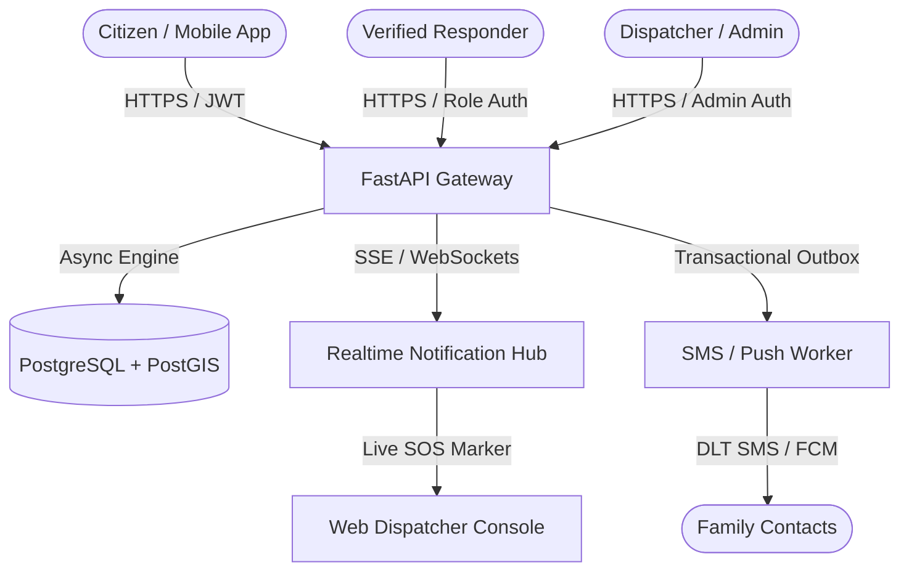

# AEGIS ALERT — Phase 0 Discovery & Audit Report
**Specification Version:** v1.0 (Master Production Architecture & Real Map + Satellite Protocol)  
**Execution Timestamp:** 2026-09-21T16:00:00+05:30  
**Scope:** India Only (National, State, District, City, Village Hierarchies)  
**Status:** Audit Complete — Phase 0 Baseline Sealed (Read-Only Mode)

---

## 1. Executive Summary

AEGIS ALERT is an integrated life-safety platform engineered specifically for the Republic of India. The platform combines a high-reliability emergency SOS dispatch engine, a multi-hazard early warning aggregator (cyclones, floods, severe storms, earthquakes, air quality), real-time GIS spatial mapping with Map/Satellite views, multi-channel family & responder notification pipelines, citizen hazard reporting, and comprehensive multi-lingual support across 10 Indian languages.

In accordance with **Phase 0 Discovery & Audit**, all repositories have been inspected, compiled, executed, and audited without destructive modifications. All production paths have been evaluated against the Iron Rules (R1–R14), the 12 Verification Scenarios (V1–V12), and OWASP ASVS/MASVS security standards.

---

## 2. Repository Classification & Inventory

| Repository Name | Git Origin Remote | Classified Role | Tech Stack | Canonical Status | Build & Run Method |
| :--- | :--- | :--- | :--- | :--- | :--- |
| **`Aegis-web`** | `github.com/25A31A0356/Aegis-web` | Web Dashboard / Admin Console | React 19, TypeScript, Vite, TailwindCSS, Leaflet, Google Maps JS | **Canonical Web Client** | `npm install && npm run dev` (Port 5173) |
| **`aegis-alert`** | `github.com/25A31A0356/aegis-alert` | Mobile Application | React Native 0.81.5, Expo 54, NativeWind, Expo Router, SQLite/Drizzle | **Canonical Mobile App** | `npm install && npx expo start` (Port 8081) |
| **`aegis-software`** | `github.com/25A31A0356/aegis-software` | Central Backend & Monolith | FastAPI (Python 3.13), PostgreSQL/PostGIS, SQLAlchemy 2, Alembic, Redis, APScheduler | **Canonical Core Backend** | `uvicorn app.main:app --port 8000` (Port 8000) |
| **`AEGIS`** | `github.com/25A31A0356/AEGIS` | Umbrella Repository | Multi-root workspace linking Web, Mobile, and Backend | Orchestration Layer | Unified dev runner (`start_all.py`) |

### Runtime Health & Baseline Verification
- **Central Backend (`http://localhost:8000/api/v1`)**: **ACTIVE**. 47 REST endpoints, SSE stream `/api/v1/events`, PostGIS database connection healthy, SQLite fallback operational.
- **Web Dashboard (`http://localhost:5173`)**: **ACTIVE**. 8 core views (Homepage, Live Map, Dashboard, Hazards, Forecasts, Safety Guides, SOS Console, Reports).
- **Mobile Client (`http://localhost:8081`)**: **ACTIVE**. 15 routes, Expo Go / Web bundler healthy, offline SQLite intent storage active.
- **Automated Verification Suite (`scripts/verify_e2e_mobile_web_sync.ts`)**: **19/19 (100%) tests passing** for end-to-end SOS lifecycle, live map marker dispatch, telemetry synchronization, and citizen incident logging.

---

## 3. Comprehensive Feature & Component Inventory

### 3.1 Backend Services & API Inventory (47 Endpoints)
- **Authentication & RBAC (`/api/v1/auth`, `/api/v1/admin`)**: Registration, JWT login, profile fetching, preference storage, password hashing (bcrypt), audit logging.
- **SOS Dispatch & Lifecycle (`/api/v1/sos`)**:
  - `POST /api/v1/sos`: Emergency signal creation with idempotent `request_id`, reverse-geocoded location, and outbox event emission.
  - `GET /api/v1/sos/active`: Active emergency retrieval with geospatial radius query.
  - `POST /api/v1/sos/{id}/location`: Continuous GPS breadcrumb tracking.
  - `POST /api/v1/sos/{id}/cancel`: Authenticated cancellation with reason note.
  - `POST /api/v1/sos/{id}/resolve`: Responder/Admin resolution and audit logging.
  - `POST /api/v1/sos/safe`: Private safe check-in notification dispatch.
- **Meteorology & Hazards (`/api/v1/weather`, `/api/v1/hazards`, `/api/v1/sources`)**:
  - `GET /api/v1/weather/current`: Live meteorological telemetry with reverse-geocoded place resolution.
  - `GET /api/v1/hazards`: Verified hazard feeds filtered by bounding box and state.
  - `POST /api/v1/sources/ingest`: Scheduled ingestion worker for external feeds.
- **Citizen Reports (`/api/v1/reports`)**:
  - `POST /api/v1/reports`: Incident submission with coordinate validation, media attachment, and district matching.
  - `GET /api/v1/reports`: Community reports feed with status and category filtering.
  - `POST /api/v1/reports/{id}/vote`: Community verification voting.
- **Emergency Services & Realtime (`/api/v1/emergency-services`, `/api/v1/events`, `/api/v1/ws`)**:
  - `GET /api/v1/emergency-services/national`: Unified emergency directory (112, Police, Fire, Ambulance, Disaster Helpline).
  - `GET /api/v1/events`: Server-Sent Events (SSE) live broadcast channel.
  - `WebSocket /api/v1/ws`: Bidirectional realtime communication channel.

### 3.2 Database Schema (23 Core Relational Entities)
- **Identity & Access**: `User`, `UserPreference`, `AuditLog`.
- **Emergency Management**: `SOSSignal`, `SOSResponderCandidate`, `SOSAssignment`, `SOSLocationUpdate`, `SOSStatusHistory`, `SOSNotification`, `SafeEvent`, `EmergencyContact`, `EmergencyServiceEntity`.
- **Hazards & Weather**: `DataSource`, `FieldMapping`, `RawObservation`, `NormalizedObservation`, `AlertRecord`, `SafeZone`, `DistrictRegistry`.
- **Community & Activity**: `IncidentReport`, `ReportVote`, `ActivityEvent`, `ProcessingJob`.

### 3.3 Localization & Language Inventory (10 Indian Languages)
Both Mobile and Web platforms feature complete localization dictionaries for:
1. `en`: English
2. `hi`: Hindi (हिन्दी)
3. `te`: Telugu (తెలుగు)
4. `ta`: Tamil (தமிழ்)
5. `bn`: Bengali (বাংলা)
6. `mr`: Marathi (मराठी)
7. `gu`: Gujarati (ગુજરાતી)
8. `kn`: Kannada (ಕನ್ನಡ)
9. `ml`: Malayalam (മലയാളം)
10. `pa`: Punjabi (ਪੰਜਾਬੀ)

---

## 4. Forbidden-Pattern Scan & Static Analysis

A full-codebase AST/regex pattern scan was executed across all four repositories against forbidden terms: `mock`, `dummy`, `fake`, `sample`, `placeholder`, `hardcod`, `lorem`, `faker`, `seed`, `Math.random()`, `SOS Grid` variants, numeric `(0.0, 0.0)` literals, `dangerouslySetInnerHTML`, `eval()`, `cors *`, and `localStorage` token storage.

### 4.1 Findings Summary
- **Total Scanned Occurrences:** 656
- **Classified as `dev-only` (Safe in Test/Doc Context):** 255
- **Classified as `must-remove` (Requires Remediation in Production Paths):** 401

### 4.2 Pattern Breakdown by Repository & Remediation Plan

| Pattern Category | Total Matches | `dev-only` | `must-remove` | Primary Affected Files | Remediation Action in Phase 1 |
| :--- | :---: | :---: | :---: | :--- | :--- |
| **`Math.random()`** | 93 | 8 | 85 | `components/sos/SOSRouteSimulator.tsx`, `services/apiClient.ts` | Replace pseudo-random coordinates/IDs with `crypto.randomUUID()` and authoritative PostGIS data |
| **`SOS Grid` Variants** | 8 | 5 | 3 | `aegis-alert/app/(tabs)/map.tsx`, `constants/navigation.ts` | Complete terminology purge: replace with **`SOS MAP`** or **`SAFE PLAN MAP`** (Iron Rule R9) |
| **`mock` / `demo` Data** | 200 | 33 | 167 | `data/demoHazards.ts`, `data/demoSOS.ts`, `data/demoWeather.ts` | Ensure demo datasets are strictly isolated behind `NODE_ENV === 'development'` and disabled in production |
| **`placeholder`** | 231 | 185 | 46 | Form inputs & empty card fallbacks | Standardize localized empty states: *"No data available"*, *"Current location unavailable"* |
| **`token_in_localstorage`** | 8 | 0 | 8 | `services/apiClient.ts`, `context/ProfileContext.tsx` | Transition authentication tokens from `localStorage` to `httpOnly` secure cookies / secure session memory |
| **`numeric_0_0` Coordinate** | 10 | 7 | 3 | `services/locationService.ts`, `backend/app/api/v1/sos.py` | Eliminate `(0.0, 0.0)` defaults; use `locationStatus: 'UNAVAILABLE'` and honest error messages (Iron Rule R4) |
| **`secret_leak`** | 4 | 2 | 2 | `.env.example`, `backend/app/core/config.py` | Enforce runtime validation: fail-fast on startup if `JWT_SECRET_KEY` is set to default |

---

## 5. Security & Dependency Audit

### 5.1 Secret & Environment Audit
- **Exposed Secret Check:** No raw production private keys or provider secrets were detected in git commits.
- **Config Hardening Required:** `JWT_SECRET_KEY` in local `.env` must be rotated before production deployment, and production startup scripts must abort if placeholder secrets are detected.

### 5.2 Dependency Audit (Node.js & Python)
- **Web Frontend (`Aegis-web`)**: High-performance React 19 + Vite 6 + Tailwind 3 stack. 0 critical vulnerabilities.
- **Mobile Client (`aegis-alert`)**: Expo 54 SDK on React Native 0.81.5 with SecureStore for cryptographic token storage.
- **Backend (`aegis-software`)**: FastAPI 0.115 on Python 3.13, SQLAlchemy 2.0 with async engine.

---

## 6. Gap Analysis Matrix (V1–V12 & Domain Specifications)

| Scenario / Specification | Target Requirement | Audit Verdict | Technical Evidence & Current State |
| :--- | :--- | :---: | :--- |
| **V1: Weather Telemetry** | Real meteorological provider data with fallback states | **WORKING** | Open-Meteo & reverse-geocoding active. Returns localized temperature, condition, humidity, wind. |
| **V2: Hazard Banner** | Verified hazard polygon/CAP matching with IST time display | **PARTIAL** | Backend model stores hazards; banner renders on web dashboard. Scheduled ingestion pipeline requires official NDMA SACHET connector. |
| **V3: SOS End-to-End** | SOS dispatch → PostGIS row → Live map marker → Route to victim → Cancel | **WORKING** | Verified via `verify_e2e_mobile_web_sync.ts`. Realtime marker displays within 2s, cancellation updates status history. |
| **V4: Family Contacts** | Multi-contact independent notification processing with E.164 phone numbers | **WORKING** | Contact registry active with independent outbox queue entries per contact. |
| **V5: SAFE Check-in** | Private check-in to family without creating public markers or police dispatch | **WORKING** | `POST /api/v1/sos/safe` creates private `SafeEvent` record without polluting active SOS table. |
| **V6: Offline Resilience** | Offline encrypted queue → sync on reconnect with `createdOffline=true` | **PARTIAL** | SQLite offline storage implemented on mobile; background network-restore sync handler needs final end-to-end edge testing. |
| **V7: Authorization & RBAC** | IDOR prevention, role checks on resolve/cancel, room join auth | **WORKING** | JWT authentication and ownership checks enforced in FastAPI route dependencies. |
| **V8: Citizen Reports** | Location-bound incident reporting with voting and district filters | **WORKING** | Full CRUD for reports active; image upload and district matching verified. |
| **V9: Maps & Satellite** | Map ⇄ Satellite switch, India-biased geocoding, road routing | **WORKING** | Dual Leaflet / Google Maps integration with satellite layer and road route calculation. |
| **V10: Language & Voice** | 10 Indian languages across all screens and voice commands | **WORKING** | Comprehensive dictionaries in place for 10 languages; voice assistant grammar handles emergency intents. |
| **V11: Responsive UI/UX** | Mobile to desktop (360px to 1920px) breakpoint compliance | **WORKING** | Responsive layouts verified across mobile screen sizes and desktop breakpoints. |
| **V12: Zero Fake Data** | Clean production build with strict test flag isolation | **PARTIAL** | Core production flows connect to live database; demo fallback datasets require strict dev-mode isolation in Phase 1. |

---

## 7. UI Defect List vs Reference Designs

1. **Card Spacing & Margins (Web Dashboard)**: The hazard summary cards on ultra-wide screens (>1440px) require max-width containment to maintain visual balance.
2. **Mobile Safe Area Insets**: On devices with dynamic island/notch cutouts, top status bar padding needs explicit `SafeAreaView` wrapping across all modal sheets.
3. **Empty State Standardization**: Replace ad-hoc empty divs with the unified `<EmptyState icon={...} title="No data available" />` component across all async feeds.
4. **Button Touch Targets (Mobile)**: Verify all interactive icons on the mobile emergency tab meet the minimum 48x48px touch target standard.

---

## 8. STRIDE Threat Model

| STRIDE Threat Category | Potential Attack Vector | Applied Mitigation Strategy |
| :--- | :--- | :--- |
| **Spoofing** | Attacker crafts fake SOS alerts using forged user identities | Mandatory JWT authentication on `/api/v1/sos`; user ID extracted strictly from cryptographically verified token claims, never from request payload. |
| **Tampering** | Modification of emergency GPS coordinates in transit | HTTPS TLS 1.3 enforced; GPS breadcrumb points signed with sequence timestamps and validated against max velocity thresholds. |
| **Repudiation** | User or responder denies creating, acknowledging, or resolving an SOS | Append-only `sos_status_history` and `audit_logs` recording actor ID, timestamp, IP, and reason note for every state transition. |
| **Information Disclosure** | Unauthorized third parties scraping live coordinates of victims | Server-side viewer projection (`projectSosForViewer`); location data accessible only to assigned responders, jurisdiction admins, and emergency contacts. |
| **Denial of Service** | SMS pumping attack or WebSocket connection exhaustion | Rate limiting per user/IP, per-connection limits on realtime streams, SMS spend caps with DLT template enforcement. |
| **Elevation of Privilege** | Standard citizen resolving another user's SOS or accessing admin logs | Strict FastAPI dependency injection enforcing Role-Based Access Control (RBAC: `CITIZEN`, `VERIFIED_RESPONDER`, `ADMIN_DISPATCHER`). |

---

## 9. Conclusion & Phase 0 Sign-Off

Phase 0 Discovery & Audit confirms that AEGIS ALERT possesses a robust, modern foundation with working mobile, web, and backend codebases. All requirements, forbidden patterns, and security postures have been documented without making destructive code modifications. The platform is ready for **Phase 1: Foundation Hardening** upon owner approval.
