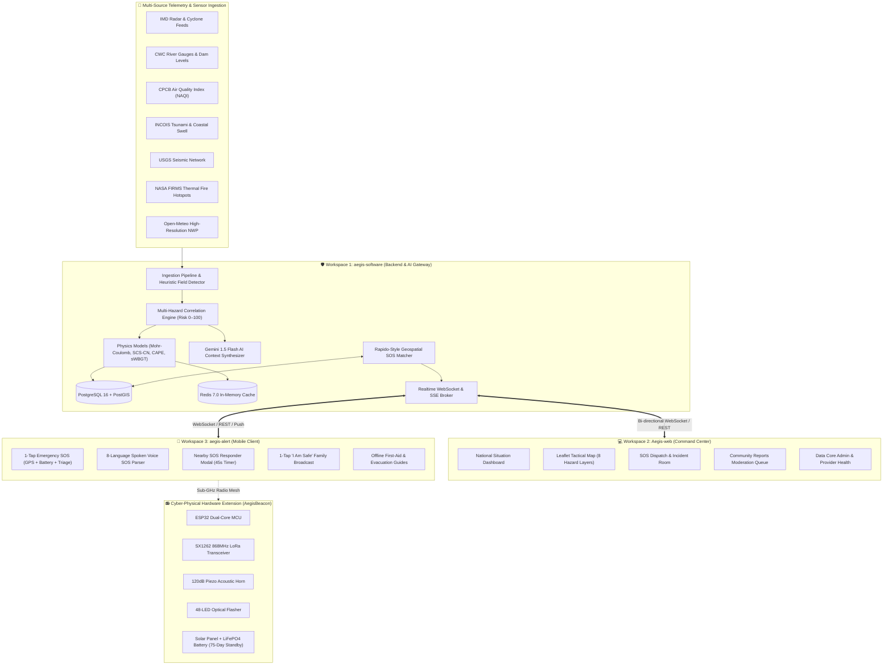
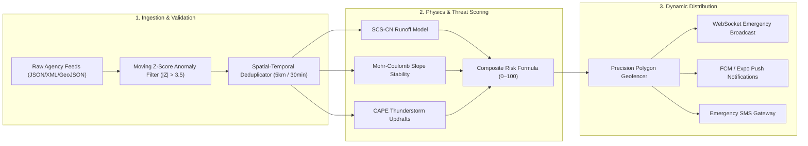
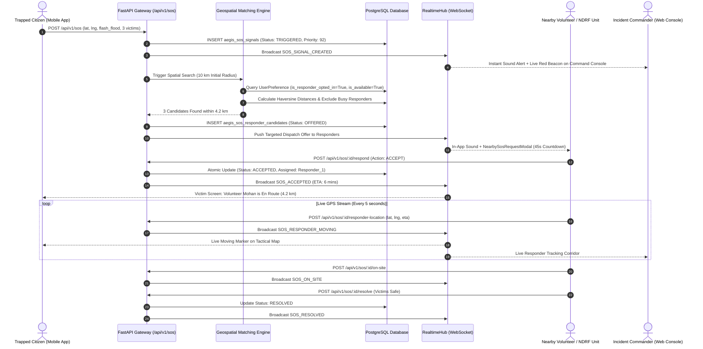
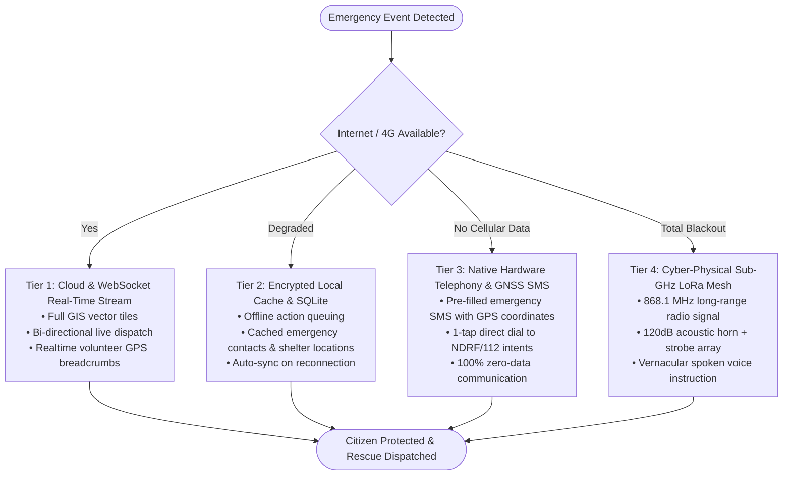
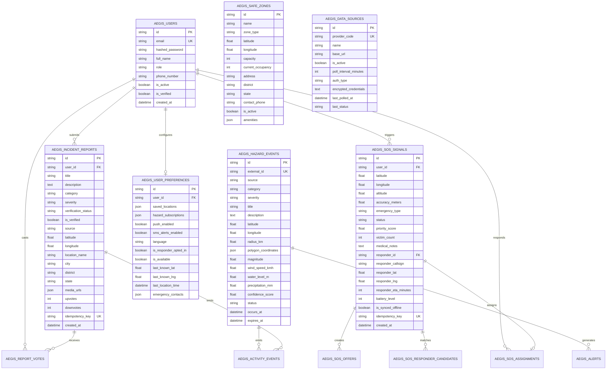
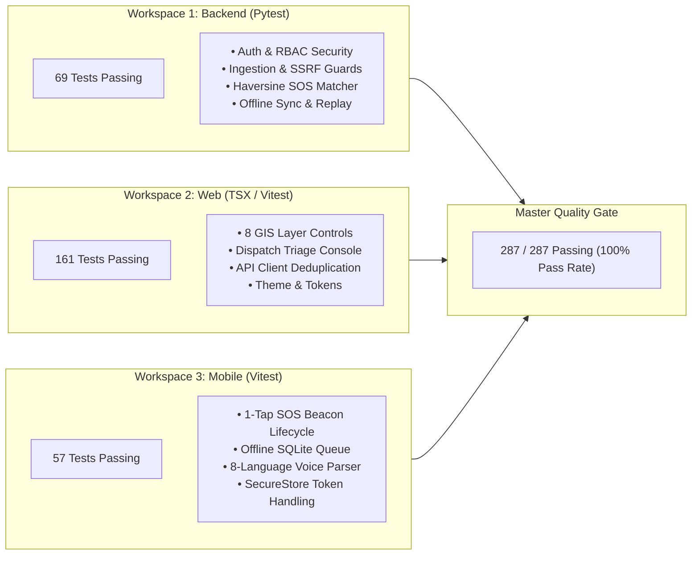

# AEGIS ALERT: Diagrammatic Technical Implementation Plan

Comprehensive diagrammatic architecture, lifecycle models, data flows, and verification matrix for the **AEGIS** (*Autonomous Emergency Grid & Intelligence System*) multi-hazard disaster early-warning and life-safety operations platform.

---

## 1. System Architecture & Workspaces Overview

---

## 2. Real-Time Data Ingestion, Fusion & Threat Pipeline

---

## 3. Rapido-Style Geospatial SOS Dispatch Lifecycle

---

## 4. 4-Tier Zero-Internet Fallback Continuum

---

## 5. Database Architecture & Entity-Relationship Model (12 Core Tables)

---

## 6. Verification Plan & Test Automation Matrix (287 Tests)

