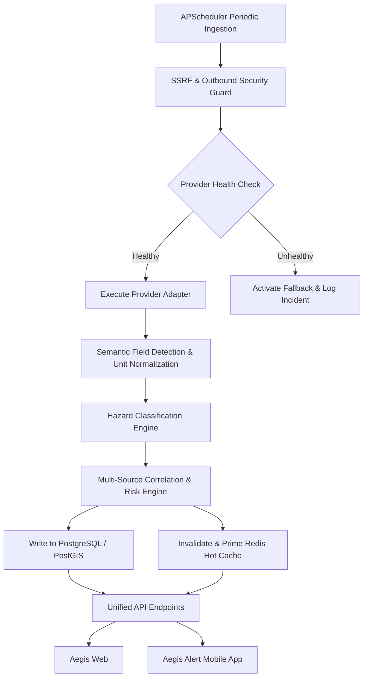

# AEGIS Central Data Gateway — Provider Configuration & Integration Checklist

This document details the configuration, credentials, rate limits, and fallback strategies for all 8 official multi-hazard telemetry providers integrated into the **AEGIS Central Data Gateway**.

> [!IMPORTANT]
> **Zero Credential Exposure Rule**: Third-party API keys and tokens must exist **ONLY** in backend `.env` configurations or in the AES-256 Fernet encrypted PostgreSQL data store. Clients (Aegis Web & Aegis Alert App) will **never** receive raw provider keys.

---

## 1. Provider Configuration Checklist

### [1] Weather & Meteorological Telemetry
- **Provider**: Open-Meteo Global NWP & IMD Telemetry Network
- **Purpose**: Real-time atmospheric conditions (temperature, apparent temp, relative humidity, barometric pressure, wind speed, wind direction, rainfall, UV index, cloud cover, visibility) and multi-day hourly forecast models.
- **Required key**: None for open tier (Optional commercial API key for high-throughput enterprise tiers).
- **Environment variable**: `OPEN_METEO_API_KEY` (Optional)
- **API base URL**: `https://api.open-meteo.com/v1/forecast`
- **Required permissions**: Outbound HTTPS GET
- **Rate limits**: 10,000 calls/day on standard open tier; up to 1,000,000 calls/day on commercial tier.
- **Free/paid limitations**: Open tier provides hourly forecasts up to 16 days globally at 1-11km resolution without billing.
- **Fallback**: Stale Redis cache observation (TTL 300s) -> Last recorded PostgreSQL `normalized_observations` row -> Regional atmospheric model centroid interpolation. **No fabricated synthetic values.**

---

### [2] Seismic & Earthquake Monitoring
- **Provider**: USGS Earthquake Hazards Program & National Seismology Grid
- **Purpose**: Global real-time seismic monitoring, earthquake epicenter coordinates, magnitude, focal depth, event timestamps, and tsunami potential flags.
- **Required key**: None (Public USGS Real-Time GeoJSON Feed).
- **Environment variable**: N/A
- **API base URL**: `https://earthquake.usgs.gov/earthquakes/feed/v1.0/summary/all_hour.geojson`
- **Required permissions**: Outbound HTTPS GET
- **Rate limits**: Open public endpoint (polled every 60 seconds with ETag/If-Modified-Since caching headers).
- **Free/paid limitations**: Unrestricted global earthquake telemetry down to M0.1.
- **Fallback**: Redis hot seismic cache (TTL 120s) -> PostgreSQL historical seismic catalog -> Marked as `SEISMIC_TELEMETRY_UNAVAILABLE` with status `DEGRADED`.

---

### [3] Satellite Thermal Wildfire & Hotspot Detection
- **Provider**: NASA FIRMS (Fire Information for Resource Management System)
- **Purpose**: Near real-time active fire and thermal anomaly detection via VIIRS (SNPP & NOAA-20/21) and MODIS (Terra & Aqua) satellites.
- **Required key**: NASA FIRMS MAP_KEY (Free 32-character token from earthdata.nasa.gov).
- **Environment variable**: `NASA_FIRMS_MAP_KEY`
- **API base URL**: `https://firms.modaps.eosdis.nasa.gov/api/area/csv/{MAP_KEY}/VIIRS_SNPP_NRT/{AREA}/{DAYS}`
- **Required permissions**: Outbound HTTPS GET with valid MAP_KEY token.
- **Rate limits**: Up to 5,000 transactions per 10-minute window per IP/key.
- **Free/paid limitations**: Free tier provides NRT (Near Real Time, ~3 hour latency) thermal anomalies with Fire Radiative Power (MW) and confidence scores.
- **Fallback**: Cached active wildfire hotspots -> Historical fire perimeter records -> Marked as `WILDFIRE_TELEMETRY_UNAVAILABLE`.

---

### [4] Cyclones & Severe Storm Warnings
- **Provider**: India Meteorological Department (IMD) / National Open Data Portal (Data.gov.in)
- **Purpose**: Tropical cyclone tracking, central barometric pressure, sustained maximum wind speeds, track cones of uncertainty, and severe storm bulletins.
- **Required key**: Data.gov.in API Key / IMD Cyclone Warning Division Token.
- **Environment variable**: `IMD_API_KEY`
- **API base URL**: `https://api.data.gov.in/resource/{RESOURCE_ID}` / `https://mausam.imd.gov.in/api/cyclone`
- **Required permissions**: Outbound HTTPS GET with `api-key` query param or Authorization header.
- **Rate limits**: 1,000 requests/hour per API key.
- **Free/paid limitations**: Free government open data tier for registered developers and emergency services.
- **Fallback**: Active bulletin store in PostgreSQL -> INCOIS surge telemetry -> Marked as `CYCLONE_TELEMETRY_UNAVAILABLE`.

---

### [5] River Basin & Flood Hydrology
- **Provider**: Central Water Commission (CWC India) & National Water Informatics Center
- **Purpose**: River gauge stages, water levels (meters), warning levels, danger levels, discharge (cumecs), and flood rising/falling trends.
- **Required key**: CWC / National Hydrology Project Access Token.
- **Environment variable**: `CWC_API_KEY`
- **API base URL**: `https://ffs.india-water.gov.in/api/v1/stations`
- **Required permissions**: Outbound HTTPS GET.
- **Rate limits**: 500 requests/hour.
- **Free/paid limitations**: Free for disaster management authorities and registered research institutions.
- **Fallback**: Stale gauge observations with clear timestamps -> Offline river basin danger threshold database -> `FLOOD_TELEMETRY_DEGRADED`.

---

### [6] Tsunami & Coastal Marine Hazards
- **Provider**: INCOIS (Indian National Centre for Ocean Information Services)
- **Purpose**: Coastal tsunami warnings, significant wave heights, swell surge, storm surge alerts, and sea surface temperatures.
- **Required key**: INCOIS Web Service Token / Open OGC WFS endpoint.
- **Environment variable**: `INCOIS_API_KEY` (Optional)
- **API base URL**: `https://incois.gov.in/portal/osf/service`
- **Required permissions**: Outbound HTTPS GET.
- **Rate limits**: 600 requests/hour.
- **Free/paid limitations**: Unrestricted public access for emergency alerts and ocean state forecasts.
- **Fallback**: Cached coastal buoy observations -> Marked as `COASTAL_SURGE_UNAVAILABLE`.

---

### [7] National Air Quality Index (AQI)
- **Provider**: Central Pollution Control Board (CPCB) / Open-Meteo Air Quality Grid
- **Purpose**: Continuous ambient air quality monitoring (PM2.5, PM10, NO2, SO2, CO, Ozone, and composite AQI).
- **Required key**: Data.gov.in CPCB Token (or Open-Meteo AQ Open Access).
- **Environment variable**: `CPCB_API_KEY`
- **API base URL**: `https://air-quality-api.open-meteo.com/v1/air-quality`
- **Required permissions**: Outbound HTTPS GET.
- **Rate limits**: 10,000 calls/day.
- **Free/paid limitations**: Global Copernicus & CPCB atmospheric composition feeds.
- **Fallback**: Regional Air Quality Index averages -> Historical station baselines.

---

### [8] Geographic & Administrative Boundary Engine
- **Provider**: Open-Meteo Geocoding API & AEGIS National Centroid Registry
- **Purpose**: Forward geocoding, reverse geocoding, locality resolution, district/state administrative boundaries, elevation, and timezones.
- **Required key**: None (Open Access + Built-in Offline Centroid Registry).
- **Environment variable**: N/A
- **API base URL**: `https://geocoding-api.open-meteo.com/v1/search`
- **Required permissions**: Outbound HTTPS GET.
- **Rate limits**: Unlimited for internal offline dictionary; 10,000 calls/day for remote geocoding.
- **Free/paid limitations**: Built-in 24-state offline fallback guarantees zero failure even during complete internet blackout.
- **Fallback**: Instant offline Haversine distance matching against curated Indian administrative centroids.

---

## 2. Ingestion & Polling Architecture

---

## 3. Dynamic Field Detection & Unit Normalization

When an external provider is polled or registered via the Admin Console, the **Heuristic Field Detector** parses sample records and infers standard mappings:

### Semantic Field Matching Patterns
- **Temperature**: `r"(temp|temperature|temp_c|temp_f|t2m|air_temp|dry_bulb)"` $\to$ `temperature_c`
- **Wind Speed**: `r"(wind_speed|wind_spd|wind_velocity|wspd|wind_kph|wind_mph|wind_ms)"` $\to$ `wind_speed_kmh`
- **Precipitation**: `r"(precip|precipitation|rain|rainfall|rain_mm|rain_in|prcp)"` $\to$ `precipitation_mm`
- **Pressure**: `r"(press|pressure|baro|barometer|slp|mslp|surf_press|pressure_hpa|pressure_pa)"` $\to$ `pressure_hpa`
- **River Water Level**: `r"(water_level|gauge_height|river_stage|stage_m|level_m|water_depth)"` $\to$ `water_level_m`
- **Seismic Magnitude**: `r"(mag|magnitude|richter|eq_mag|mag_val)"` $\to$ `magnitude`
- **Air Quality / Particulates**: `r"(pm25|pm2_5|pm_2_5|pm10|pm_10|aqi|air_quality_index)"` $\to$ `pm25`, `pm10`, `aqi`
- **Thermal Fire Power**: `r"(frp|fire_power|fire_radiative_power|thermal_mw)"` $\to$ `fire_radiative_power`

### Physical Unit Conversions Applied
All metrics are stored internally in standard SI / scientific units:
- **Temperature**: Fahrenheit $\to$ Celsius ($T_C = (T_F - 32) \times \frac{5}{9}$); Kelvin $\to$ Celsius ($T_C = T_K - 273.15$)
- **Speed**: Miles/hour $\to$ km/h ($v_{kmh} = v_{mph} \times 1.60934$); Knots $\to$ km/h ($v_{kmh} = v_{kts} \times 1.852$)
- **Precipitation**: Inches $\to$ mm ($P_{mm} = P_{in} \times 25.4$)
- **Pressure**: Pascals $\to$ hPa ($p_{hPa} = p_{Pa} / 100.0$); inHg $\to$ hPa ($p_{hPa} = p_{inHg} \times 33.8639$)
