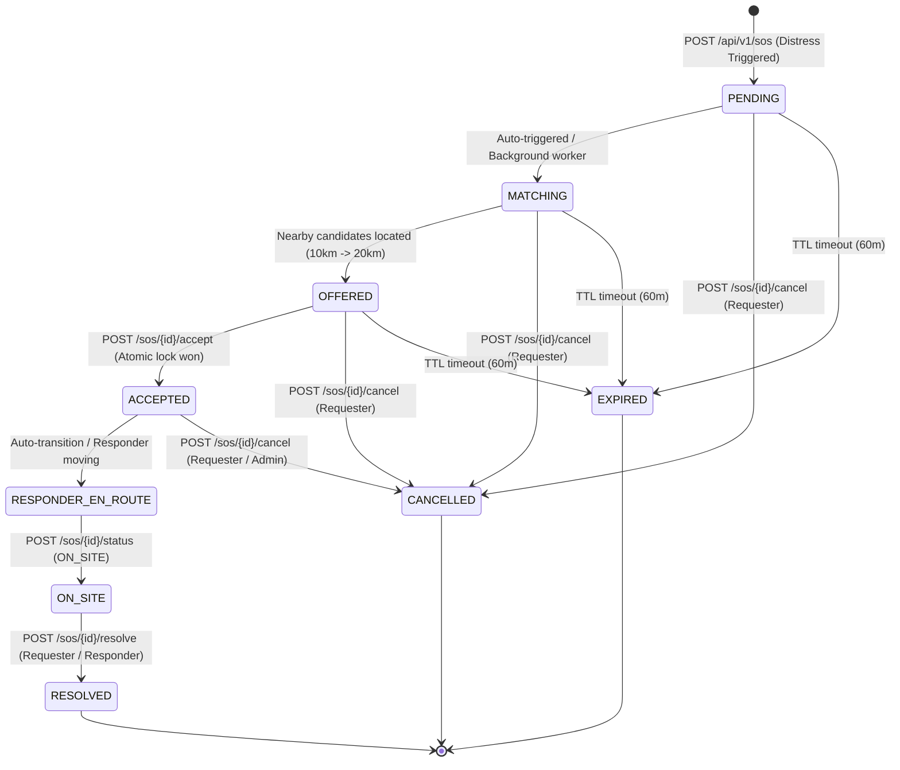

# AEGIS SOS Nearby-Responder Network — Architecture & Integration Specification

**Version**: `1.0.0`  
**Backend Base URL**: `http://localhost:8000/api/v1`  
**WebSocket Endpoints**: `ws://localhost:8000/api/v1/ws` & `ws://localhost:8000/api/v1/ws/sos`

The **Aegis SOS Nearby-Responder Network** is an emergency response coordination engine built into the Aegis Software central backend. It matches individuals in acute distress with verified, nearby community and professional responders in real time, manages the emergency lifecycle through an audit-logged state machine, tracks live GPS breadcrumbs, computes driving routes/ETAs, and alerts family emergency contacts.

---

## 1. Core Architecture & Lifecycle State Machine



### State Definitions
1. **`PENDING`**: Distress signal registered, family contacts alerted.
2. **`MATCHING`**: Geospatial discovery engine searching for available opted-in responders.
3. **`OFFERED`**: Push notifications & WebSocket offers dispatched to qualified candidates.
4. **`ACCEPTED`**: Primary responder atomically assigned; full exact coordinate exchange unlocked.
5. **`RESPONDER_EN_ROUTE`**: Responder is traveling towards requester; live breadcrumb tracking active.
6. **`ON_SITE`**: Responder has reached the distress location.
7. **`RESOLVED`**: Emergency successfully resolved with optional resolution notes.
8. **`CANCELLED`**: Cancelled by requester with reason.
9. **`EXPIRED`**: Expired after TTL (`SOS_EXPIRATION_MINUTES = 60`) without acceptance.

---

## 2. Privacy & Security Model

- **Pre-Acceptance Privacy (Rapido-like Offers)**:
  - Responders received coarse distance (e.g., `2.4 km away`) and emergency category (e.g., `MEDICAL`, `TRAPPED`, `FIRE`).
  - Requester's exact GPS coordinates and personally identifiable information (full name, phone number) are **strictly masked** until an offer is accepted.
- **Post-Acceptance Security**:
  - Full coordinate exchange is enabled only between the matched requester and the accepted primary responder.
  - Active assignment token validation ensures unauthorized users cannot inject fake GPS telemetry or cancel another user's SOS.
- **Atomic Acceptance Guarantee**:
  - Database row-level locking (`SELECT ... FOR UPDATE`) prevents double-acceptance race conditions when multiple responders click "Accept" simultaneously. Only the first successful responder is granted the assignment; subsequent requests receive `409 Conflict`.

---

## 3. Database Schema

- `aegis_sos_signals` (`SOSSignal` / `SOSIncident`): Core incident record with coordinates, status, requester ID, accepted responder ID, timestamps.
- `aegis_sos_responder_candidates` (`SOSResponderCandidate`): Offer dispatch logs with candidate user ID, offer distance, response status (`OFFERED`, `ACCEPTED`, `DECLINED`, `EXPIRED`, `CANCELLED`).
- `aegis_sos_assignments` (`SOSAssignment`): Active responder assignment, ETA seconds, remaining distance meters, GeoJSON route line string, route recalculation flags.
- `aegis_sos_location_updates` (`SOSLocationUpdate`): High-frequency breadcrumbs for requester & responder (lat, lng, accuracy, speed, bearing).
- `aegis_sos_status_history` (`SOSStatusHistory`): Immutable audit trail of all state changes, actors, timestamps, and reason metadata.
- `aegis_sos_notifications` (`SOSNotification`): Notification dispatch ledger (channel: `WEBSOCKET`, `PUSH`, `SMS`, `EMAIL`, `FAMILY_ALERT`).
- `user_preferences` (`UserPreference`): Responder settings (`is_responder_opted_in`, `is_available`, `last_known_lat`, `last_known_lng`, `emergency_contacts`).

---

## 4. REST API Reference

### 4.1 Trigger Distress Signal
**`POST /api/v1/sos`**
- **Auth**: Public or Bearer JWT (Optional user ID)
- **Request Body**:
```json
{
  "latitude": 19.0760,
  "longitude": 72.8777,
  "accuracy_meters": 12.5,
  "emergency_type": "MEDICAL",
  "short_message": "Need immediate first aid at building entrance",
  "blood_group": "O+",
  "medical_notes": "Asthma patient",
  "emergency_contacts": [
    {"name": "Jane Doe", "phone": "+919876543210", "relationship": "Spouse"}
  ],
  "battery_level": 82,
  "anonymous": false
}
```
- **Response**:
```json
{
  "success": true,
  "data": {
    "sos_id": "a1b2c3d4-e5f6-7890-abcd-ef1234567890",
    "status": "OFFERED",
    "emergency_type": "MEDICAL",
    "matched_candidates": 3,
    "offered_responders": 3,
    "contacts_notified": 1,
    "created_at": "2026-09-19T18:30:00Z"
  }
}
```

### 4.2 Query Nearby SOS Incidents (Responder View)
**`GET /api/v1/sos/nearby?lat=19.0760&lng=72.8777&radius_km=10.0`**
- **Auth**: Bearer JWT (Recommended for opted-in responders)
- **Response**: List of active incidents within radius. For unaccepted incidents, exact coordinates are obfuscated to coarse centroid for privacy.

### 4.3 Get Detailed SOS Status
**`GET /api/v1/sos/{sos_id}`**
- **Response**: Full incident status, current responder assignment (if accepted), route ETA, and latest breadcrumbs.

### 4.4 Accept Responder Offer (Atomic)
**`POST /api/v1/sos/{sos_id}/accept`**
- **Auth**: Bearer JWT or Request Body
- **Request Body**:
```json
{
  "responder_id": "usr_responder_123",
  "latitude": 19.0820,
  "longitude": 72.8810
}
```
- **Success Response (200 OK)**:
```json
{
  "success": true,
  "data": {
    "sos_id": "a1b2c3d4-e5f6-7890-abcd-ef1234567890",
    "status": "ACCEPTED",
    "accepted_by": "usr_responder_123",
    "requester_location": {
      "latitude": 19.0760,
      "longitude": 72.8777
    },
    "route": {
      "distance_km": 0.85,
      "distance_meters": 850,
      "eta_minutes": 3.2,
      "eta_seconds": 192,
      "route_geometry": {
        "type": "LineString",
        "coordinates": [[72.8810, 19.0820], [72.8777, 19.0760]]
      }
    }
  }
}
```
- **Race Condition Failure (409 Conflict)**:
```json
{
  "success": false,
  "error": {
    "code": "ALREADY_ACCEPTED",
    "message": "This SOS incident has already been accepted by another responder",
    "status": 409
  }
}
```

### 4.5 Decline Responder Offer
**`POST /api/v1/sos/{sos_id}/decline`**
- **Request Body**: `{"responder_id": "usr_responder_123", "reason": "Engaged in another task"}`

### 4.6 Stream High-Frequency Live GPS Breadcrumbs
**`POST /api/v1/sos/{sos_id}/location`** (Requester)  
**`POST /api/v1/sos/{sos_id}/responder-location`** (Responder)
- **Request Body**:
```json
{
  "latitude": 19.0805,
  "longitude": 72.8795,
  "accuracy_meters": 8.0,
  "speed_mps": 6.5,
  "bearing_deg": 142.0,
  "user_id": "usr_responder_123"
}
```
- **Response**: Updated distance & ETA. If the responder moves > 150m from their last calculated route, the server automatically recalculates turn-by-turn route geometry and pushes a `ROUTE_UPDATED` WebSocket event.

### 4.7 Update Incident Status
**`POST /api/v1/sos/{sos_id}/status`**
- **Request Body**: `{"status": "ON_SITE", "user_id": "usr_responder_123", "notes": "Reached location"}`

### 4.8 Resolve Distress Incident
**`POST /api/v1/sos/{sos_id}/resolve`**
- **Request Body**: `{"resolved_by": "usr_requester", "resolution_notes": "Ambulance arrived and patient assisted."}`

### 4.9 Cancel Distress Incident
**`POST /api/v1/sos/{sos_id}/cancel`**
- **Request Body**: `{"cancelled_by": "usr_requester", "reason": "Accidental trigger, all safe."}`

### 4.10 Responder Opt-In & Availability Profile
**`POST /api/v1/sos/responder/profile`**
- **Request Body**:
```json
{
  "is_opted_in": true,
  "is_available": true,
  "latitude": 19.0765,
  "longitude": 72.8780
}
```

---

## 5. Real-Time WebSocket Channel Architecture

Connect to `ws://localhost:8000/api/v1/ws` or `ws://localhost:8000/api/v1/ws/sos`.

### Channels & Subscriptions
- **User Channel**: `user:{userId}` — Private alerts, offer dispatches, family notifications.
- **Incident Channel**: `sos:{sosId}` — Live tracking room for requester, responder, and authorized dispatchers.
- **Global Channel**: `sos` or `hazards` — Broadcasts for active emergency map overlays.

### WebSocket Event Types

1. **`SOS_OFFER`** (Sent to candidate responders):
```json
{
  "type": "SOS_OFFER",
  "sos_id": "a1b2c3d4-e5f6-7890-abcd-ef1234567890",
  "emergency_type": "MEDICAL",
  "distance_km": 1.4,
  "short_message": "Need immediate first aid",
  "timestamp": "2026-09-19T18:30:00Z"
}
```

2. **`SOS_ACCEPTED`** (Sent to requester and candidate channels):
```json
{
  "type": "SOS_ACCEPTED",
  "sos_id": "a1b2c3d4-e5f6-7890-abcd-ef1234567890",
  "responder_id": "usr_responder_123",
  "responder_name": "Dr. Alex Sharma",
  "eta_minutes": 4.5,
  "distance_km": 1.2
}
```

3. **`LOCATION_UPDATE`** (Live tracking stream):
```json
{
  "type": "LOCATION_UPDATE",
  "sos_id": "a1b2c3d4-e5f6-7890-abcd-ef1234567890",
  "sender_type": "RESPONDER",
  "latitude": 19.0780,
  "longitude": 72.8790,
  "speed_mps": 8.2,
  "bearing_deg": 135.0,
  "distance_remaining_km": 0.65,
  "eta_minutes": 2.1
}
```

4. **`ROUTE_UPDATED`** (Triggered on >150m deviation):
```json
{
  "type": "ROUTE_UPDATED",
  "sos_id": "a1b2c3d4-e5f6-7890-abcd-ef1234567890",
  "route_geometry": {
    "type": "LineString",
    "coordinates": [[72.8790, 19.0780], [72.8777, 19.0760]]
  },
  "distance_km": 0.65,
  "eta_minutes": 2.1
}
```

5. **`SOS_RESOLVED` / `SOS_CANCELLED`**:
```json
{
  "type": "SOS_RESOLVED",
  "sos_id": "a1b2c3d4-e5f6-7890-abcd-ef1234567890",
  "resolved_by": "usr_requester",
  "resolution_notes": "All safe, responder arrived."
}
```

---

## 6. Integration Checklist for Aegis Web & Aegis Alert App

| Feature | Aegis Web | Aegis Alert App | Backend Endpoint / Channel |
| :--- | :--- | :--- | :--- |
| **Trigger SOS** | SOS Panic Modal / Quick Action | Hardware Key / Panic Button | `POST /api/v1/sos` |
| **Responder Mode** | Dispatch Map Monitor | Background Location & Push Notification | `POST /api/v1/sos/responder/profile` |
| **Offer Prompt** | Accept/Decline Dialog | Interactive Actionable Push Notification | `POST /api/v1/sos/{id}/accept` |
| **Turn-by-Turn Map** | Leaflet / Mapbox Live Route Layer | Flutter Mapbox / Google Maps Nav | `GET /api/v1/sos/{id}` + WebSocket `sos:{id}` |
| **GPS Breadcrumbs** | Browser Geolocation API | Android/iOS Background Geolocation Service | `POST /api/v1/sos/{id}/location` |
| **Family Alerting** | Web SMS/Email Notification Banner | SMS Gateway / In-App Family Alerts | `aegis_sos_notifications` |
